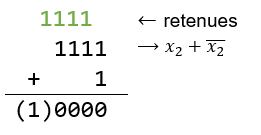

# Représentation binaire d'un entier relatif

Nous avons déjà vu comment coder en binaire des entiers positifs (entiers naturels) dans le chapitre 1. Dans ce chapitre nous allons voir comment sont représentés en machine les entiers relatifs (entiers négatifs et positifs).

# Une première représentation intuitive mais insatisfaisante : le binaire signé

Une idée simple pour représenter les entiers relatifs est :

- d’utiliser le bit de poids fort (le plus à gauche) pour représenter le signe de l’entier : 0 pour un entier positif et 1 pour un entier négatif.
- d’utiliser les autres bits pour représenter la valeur absolue de l’entier.

En procédant ainsi, si on code les entiers naturels sur 4 bits (pour simplifier), alors :

- le binaire 0011 correspondant à l’entier $3$ car :
  - $3=($011$)_2$
  - et le bit de poids fort est 0 donc il s’agit d’un entier positif
- le binaire 1011 correspondant à l’entier $-3$ car :
  - $3=($011$)_2$
  - et le bit de poids fort est 1 donc il s’agit d’un entier négatif

## Problèmes avec cette méthode

**1er problème (mineur)** : l’entier $0$ serait codé de deux façons : 0000 et 1000 ($+0$ et $-0$ , un entier *positif* et un entier *négatif*)

**2ème problème (majeur !)** : l’algorithme d’addition habituel ne fonctionne plus (lorsque l’on additionne deux entiers de signes contraires) comme le montre ces deux exemples :

Ce n’est donc pas une méthode satisfaisante car il faudrait alors redéfinir l’algorithme de l’addition. La solution la plus commune pour contourner ces problèmes est d’utiliser l’encodage dit *par complément à 2*.

# La représentation choisie : le complément à 2

## La méthode du complément à 2

<blockquote class="information">
  
On explique à la fin pourquoi cette méthode s'appelle le <em>complément à 2</em>.

</blockquote>

Considérons que l’on code nos entiers sur $n=4$  bits (on peut généraliser tout ce qui sera vu). On ne s’intéresse ici qu’à la représentation des entiers négatifs.

**Exemple : représentation du nombre $-5$ par la méthode du complément à 2**

- Étape 1 : On passe d’abord en positif : 5
- Étape 2 : On représente 5 sur 4 bits : 0101
- Étape 3 : On inverse tous les bits (les 1 deviennent 0 et réciproquement) : 1010.
- Étape 4 : On ajoute 1 au nombre obtenu (sans tenir compte de la retenue finale)

**Conclusion** : La représentation de $-5$ en complément à deux sur 4 bits est donc <strong>1011</strong>.

## Représentation circulaire de la notation en complément à deux

Les nombres binaires sont écrits dans l’ordre en tournant dans le sens des aiguilles d’une montre, tout en conservant la signification du bit de signe. Comme on n’a pas de « $−0$ » il y a un décalage de 1 dans la symétrie entre entiers positifs et négatifs alors qu’elle est parfaite pour les binaires.

Reprenons l’exemple du codage de $-5$. On est parti de 5 (étape 1), on l’a écrit en binaire (étape 2) pour obtenir 0101 puis on a inversé tous les bits (étape 3, ce qui revient à appliquer l’opérateur NON à chaque bit) pour trouver 1010 qui représente $-6$ et enfin on a ajouté 1 (étape 4) pour obtenir 1011 qui représente $-5$.

## Et dans l'autre sens ?

Connaissant une représentation en complément à 2, il est bien sûr possible de déterminer de quel entier il s’agit.

**Exemple : Quel entier est représenté par 1011 en complément à 2 (sur 4 bits) ?**

- Étape 1 : On inverse tous les bits : 0100
- Étape 2 : On ajoute 1 au résultat : 0100 + 1 = 0101
- Étape 3 : On décode l’entier positif obtenu : $5$ (car $1\times 2^0 + 1\times 2^2 = 5$)
- Étape 4 : On passe en négatif : $-5$

**Conclusion** : Donc 1011 est la représentation en complément à 2 de l’entier $-5$ (sur 4 bits).

## Plage de valeurs possibles

Si on code sur 4 bits, il est possible de représenter $2^4$ entiers. Dans la méthode du complément à 2 :

- la moitié sont des entiers positifs (ceux commençant par 0) : de 0000 à 0111
- et l’autre moitié sont des entiers strictement négatifs (ceux commençant par un 1) : de 1000 à 1111.

On peut donc représenter ainsi les entiers positifs compris entre $0$ et $7$ et les entiers strictement négatifs compris entre $-8$ et $-1$ ; c’est-à-dire tous les entiers relatifs compris entre $-8$ et $7$ (il y en a bien 16 !).

De manière générale, si on dispose de $n$ bits pour représenter des entiers en complément à 2, on peut en représenter $2^n$. La moitié d’entre eux sont des entiers positifs (il y en a $2^{n-1}$) et l’autre moitié des entiers strictement négatifs (il y en a aussi $2^{n-1}$).

Ainsi, on peut représenter tous les entiers positifs compris entre $0$ et $2^{n-1}-1$ et tous les entiers strictement négatifs compris entre $-2^{n-1}$ et $-1$, c’est-à-dire tous les entiers relatifs compris entre $-2^{n-1}$ et $2^{n-1}-1$.

## Au fait, pourquoi dit-on *complément à 2* ?

Lorsque l’on cherche à déterminer le codage de $-5$, on cherche en fait le nombre $n$ tel que $n+5=0$.

En binaire, le calcul de $5+(-5)$ est 0101 + 1011 qui donne 10000 c’est-à-dire $2^4$. Cela signifie que 1011 est le complément à $2^4$ de 0101, c’est-à-dire le nombre binaire qu’il faut ajouter à 0101 pour obtenir $2^4$. On devrait donc dire de manière plus rigoureuse **le complément à $2^4$** (puisque l’on a choisi de coder sur 4 bits).

<blockquote class="question">
  
Il n'y a pas un problème ? Je croyais que $5 + (-5)$ devait faire $0$ et non $2^4$...

</blockquote>

En fait, en binaire le résultat donne 10000 mais comme on a choisi de coder sur 4 bits, le bit 1 n’est pas pris en compte (puisque c’est le 5ème bit) et le résultat en machine est donc bien égal à 0000, c’est-à-dire 0.

**Pourquoi la méthode proposée permet de déterminer la représentation en complément à 2 d'un entier ?**

Même si la représentation circulaire permettait de comprendre l'idée, voici une explication plus rigoureuse.

Notons $x$ un entier positif et $x_2$ son écriture binaire. Si on cherche la représentation en complément à 2 de l’opposé de $x$, on cherche en fait le nombre $m$ tel que $x+m=0$.

Notons $\overline{x_2}$ le nombre binaire dans lequel on inverse tous les bits de $x_2$ (on dit que $\overline{x_2}$ est le complément à 1 de $x_2$).

On remarque alors qu’on a toujours $x_2+\overline{x_2} =$ 1111 puisque pour chaque bit on additionne un bit « 1 » avec un bit « 0 » (par exemple, 1011 + 0100 = 1111).

Si on ajoute $1$ à ce nombre, on obtient $0$. En effet :

Comme on a choisi de coder sur 4 bits, on ignore la dernière retenue et le résultat est donc 0000 soit $0$.

On vient de montrer que $x_2+\overline{x_2}+1 =0$ et donc a trouvé la représentation binaire de notre nombre $m$ (l’opposé de $x$) :

$$\overline{x_2}+1.$$

Ainsi, pour représenter un entier négatif ($m$), on part de sa valeur absolue ($x$), que l’on code en binaire ($x_2$), puis on inverse tous les bits ($\overline{x_2}$) et enfin on ajoute $1$.

---

**Références** :

- Mickaël Barraud, ressources partagées DIU EIL Nantes, pour la représentation circulaire.
- Manuel *Prépabac spécialité 1ère NSI*, C. Adobet, G. Connan, G. Rozsavolgyi, L. Signac, éditions HATIER.
- Cours de David Roche sur le complément à deux : [https://pixees.fr/informatiquelycee/n_site/nsi_prem_comp_2.html](https://pixees.fr/informatiquelycee/n_site/nsi_prem_comp_2.html).

---
Germain BECKER & Sébastien POINT, Lycée Mounier, ANGERS

