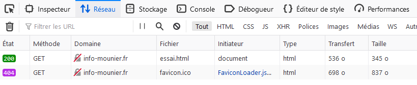
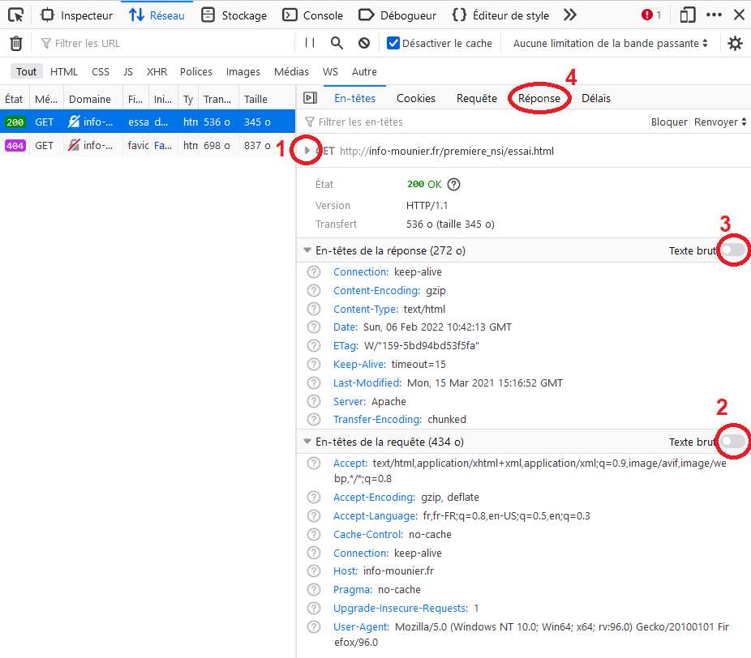

# Protocole HTTP : analyse des requêtes et réponses

L’objectif de cette activité est de visualiser le contenu de certaines requêtes HTTP et de leur réponses HTTP.

Il est très facile de visualiser le dialogue client-serveur avec les *Outils de développement Web* des navigateurs. Nous allons présenter ceux du navigateur Firefox.

# Utiliser les outils de développement du navigateur

Lancez le navigateur Firefox puis lancez les *Outils de développement Web* avec la touche F12. Cliquez ensuite sur l'onglet *Réseau* pour pouvoir observer les requêtes que nous allons faire (ainsi que leur réponses).

**1.** Tapez dans la barre d’adresse (puis validez) l’URL suivante : `http://info-mounier.fr/premiere_nsi/essai.html`. Vous devriez obtenir une liste des toutes les requêtes effectuées comme sur la capture ci-dessous.



<blockquote class="info">On peut directement remarquer que la méthode utilisée pour la requête est <code>GET</code> et que le statut de la requête est à 200 (colonne *État*), ce qui signifie que la requête a aboutit : le serveur a trouvé la ressource et l'a renvoyée.</blockquote>

# Analyse de la requête

**2.** Cliquez sur cette première requête pour observer les détails.



**3.** Déroulez les informations sur la requête GET (voir numéro 1 sur la capture d'écran) puis trouvez dans toutes les informations visibles :
- le type de requête effectuée
- la ressource demandée (voir *Filename*)
- la version du protocole utilisé

>Ces trois informations correspondent à ce que l'on appelle la *ligne de commande* de la requête (voir plus bas).

**4.** Cherchez également les informations suivantes :
- Nom du serveur contacté (*Host*)
- L'adresse IP du serveur contacté et le numéro de port (*Adresse*)
- Le client utilisé (*User-Agent*)

**5.** Affichez le texte brut de la requête (voir numéro 2 sur la capture d'écran). Vous devriez obtenir un texte similaire à celui-ci :

```
GET /premiere_nsi/essai.html HTTP/1.1
Host: info-mounier.fr
User-Agent: Mozilla/5.0 (Windows NT 10.0; Win64; x64; rv:96.0) Gecko/20100101 Firefox/96.0
Accept: text/html,application/xhtml+xml,application/xml;q=0.9,image/avif,image/webp,*/*;q=0.8
Accept-Language: fr,fr-FR;q=0.8,en-US;q=0.5,en;q=0.3
Accept-Encoding: gzip, deflate
Connection: keep-alive
Upgrade-Insecure-Requests: 1
Pragma: no-cache
Cache-Control: no-cache
```

**Analyse** : Il s'agit de la requête envoyée au serveur et on y trouve toutes les informations nécessaires. En particulier, une requête possède toujours la syntaxe suivante :

- la première ligne s'appelle la *ligne de commande*, elle contient la méthode utilisée, l'URL de la ressource demandée et la version du protocole utilisée
- puis toutes les *en-têtes de la requête* où l'on trouve : le nom du serveur, le client utilisé, le typde de document demandé, etc.
- une ligne vide pour séparer les en-têtes du corps de la requête (si le corps de la requête n'est pas vide)
- le *corps de la requête* (dans cet exemple, il est vide)

**6.** Identifiez dans la requête de la question 5, la *ligne de commande* ainsi que les *en-têtes* de la requête.

# Analyse de la réponse

On va désormais étudier la réponse du serveur.

**7.** Cherchez les informations suivantes dans les en-têtes de la réponse :
- la version du protocole utilisé
- le *code réponse* (un numéro à trouver dans *État*)
- le *texte réponse* (texte court qui suit le )

>Ces trois informations correspondent à ce que l'on appelle la *ligne de statut* de la réponse (voir plus bas).

**8.** Cherchez sur la page [https://developer.mozilla.org/fr/docs/Web/HTTP/Status](https://developer.mozilla.org/fr/docs/Web/HTTP/Status), les différents codes de réponse que le serveur peut renvoyer. Que signifie le code 200 qui a été renvoyé pour la réponse étudiée à la question précédente ?

**9.** Cherchez également dans les en-têtes les informations suivantes :
- le type de contenu envoyé (ligne *Content-Type*)
- le type de serveur utilisé

**10.** Cliquez sur l'onglet *Réponse* (voir numéro 4 sur la capture d'écran) pour voir le **corps de la réponse**. Cliquez ensuite sur *Brut* pour afficher le texte brut correspondant au corps de la réponse : il s'agit du code HTML de la page Web renvoyée !

**BILAN** : Une réponse HTTP possède la syntaxe suivante :
- la première ligne s'appelle la *ligne de statut*, elle indique la version du protocole utilisée, le *code réponse* ainsi que le *texte réponse*.
- puis toutes les *en-têtes de la réponse* où l'on trouve : le type de document envoyé, le type de serveur, les cookies éventuels, etc.
- une ligne vide pour séparer les en-têtes du corps de la réponse (si le corps de la réponse n'est pas vide)
- le *corps de la réponse* qui est le contenu de la ressource demandée (ici le code HTML de la ressource demandée : `/premiere_nsi/essai.html`)

Dans notre cas, la réponse du serveur est donc la suivante :

```
HTTP/1.1 200 OK
Content-Type: text/html
Transfer-Encoding: chunked
Connection: keep-alive
Keep-Alive: timeout=15
Date: Sun, 06 Feb 2022 10:59:26 GMT
Server: Apache
Last-Modified: Mon, 15 Mar 2021 15:16:52 GMT
ETag: W/"159-5bd94bd53f5fa"
Content-Encoding: gzip

<!DOCTYPE html>
<html lang="fr">
  <head>
    <meta charset="UTF-8" />
    <title>Informatique au lycée Mounier ANGERS</title>
    <meta name="viewport" content="width=device-width, initial-scale=1.0" />
  </head>
  <body>
    <h1>Protocole HTTP</h1>
    <p>Ceci est une page pour comprendre le protocole <b>HTTP</b></p>
  </body>
</html>
```

**11.** Dans cette réponse, identifiez la *ligne de statut*, les *en-têtes* et le *corps*.

# Questions supplémentaires

**12.** Tapez dans la barre d'adresse l'URL `https://info-mounier.fr/premiere_nsi/essai.html` (on utilise le protocole HTTPS) et vérifiez que le port utilisé n'est plus 80 mais 443 (voir numéro 1 sur la capture d'écran).

>Le port 80 est utilisé par le protocole HTTP, le port 443 par le protocole HTTPS.

**13.** Tapez dans la barre d'adresse l'URL `http://info-mounier.fr/foot.html`. Quel est le code réponse et que signifie-t-il ? (revoir [https://developer.mozilla.org/fr/docs/Web/HTTP/Status](https://developer.mozilla.org/fr/docs/Web/HTTP/Status) si besoin).

**14.** Effacez toutes les requêtes des outils de dévéloppement. Tapez ensuite dans la barre d'adresse l'URL `https://info-mounier.fr/index.php` et observez les requêtes/réponses échangées entre le navigateur et le serveur.
- Expliquez le nombre important de requêtes/réponses.
- Lister les types de documents demandés par le client.


---

**Références** :

- Page Wikipédia sur le protocole HTTP : [https://fr.wikipedia.org/wiki/Hypertext_Transfer_Protocol](https://fr.wikipedia.org/wiki/Hypertext_Transfer_Protocol)
- Documentation MDN sur les statuts de requêtes HTTP : [https://developer.mozilla.org/fr/docs/Web/HTTP/Status](https://developer.mozilla.org/fr/docs/Web/HTTP/Status)

---

Germain BECKER & Sébastien POINT, Lycée Emmanuel Mounier, ANGERS


