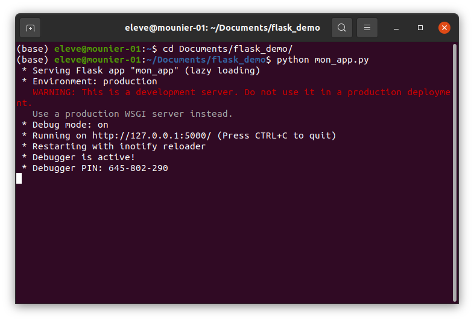
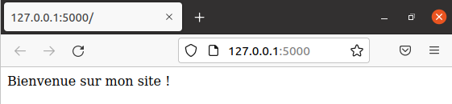
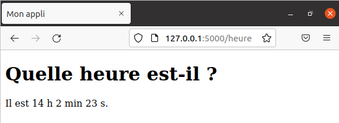

# Découverte du framework Flask


**Flask** est un micro-framework Python facilitant la création d'application Web. Il est parfait pour créer de manière simple et rapide de petites applications Web.

Voici la vidéo associée à cette activité : [https://youtu.be/Ihp_cG7c2Rk](https://youtu.be/Ihp_cG7c2Rk)

<div class="video-responsive">
    <iframe class="centre" width="560" height="315" src="https://www.youtube.com/embed/Ihp_cG7c2Rk" title="YouTube video player" frameborder="0" allow="accelerometer; autoplay; clipboard-write; encrypted-media; gyroscope; picture-in-picture" allowfullscreen></iframe>
</div>

Voici un lien vers la documentation officielle de Flask (en anglais) : [https://flask.palletsprojects.com/en/2.0.x/](https://flask.palletsprojects.com/en/2.0.x/)

> Flask est un des frameworks Python les plus populaires (avec Django notamment) car il permet également de créer des applications Web très complexes.

Sur les ordinateurs du lycée, Flask est installé. Si vous souhaitez l'installer chez vous, il suffit d'exécuter la ligne de commande

```shell
pip install flask
```

> On cherche ici la simplicité mais sachez qu'il est normalement préférable de créer un *environnement virtuel* dans lequel vous installerez Flask et tous les autres modules que vous souhaitez. La procédure d'installation est bien expliquée dans la documentation officielle de Flask : [https://flask.palletsprojects.com/en/2.0.x/installation/](https://flask.palletsprojects.com/en/2.0.x/installation/).

# Création d'une application

## Une application minimale

Dans le dossier `Documents` on commence par créer un dossier appelé `flask_demo` dans lequel on crée un fichier appelé `mon_app.py`. On obtient l'arborescence suivante :

```
/Documents
    /flask_demo
        /mon_app.py
```

Avec un éditeur de texte, on écrit les lignes suivantes dans le fichier `mon_app.py` :

**mon_app.py**

```python
from flask import Flask

app = Flask(__name__)

@app.route("/")
def bonjour():
    return "<p>Bienvenue sur mon site !</p>"

if __name__ == '__main__':
    app.run(debug=True)
```

> Ces 7 lignes de code vont permettre de créer démarrer un serveur Web (local) contenant une page à laquelle on va pouvoir accéder dans un navigateur.

**Analyse** :
- les deux premières lignes permettent d'importer la classe `Flask` et de l'utiliser pour créer une application appelée `app` grâce à l'instruction `app = Flask(__name__)`.
- on a ensuite créé une **route** pour notre application, avec le décorateur `@app.route()` qui indique à Flask quelle URL doit déclencher un appel à la fonction qui suit : ici, si un utilisateur visite l'URL `'/'` c'est-à-dire la racine de notre site, alors la fonction `bonjour()` est appelée et cette fonction renvoie le code HTML qui doit être affiché par le navigateur.
- les deux dernières lignes permettent de lancer l'application avec `app.run()` lorsque le script `mon_app.py` est exécuté directement. 

> On a donné la valeur `True` au paramètre `debug` de `app.run()` pour que le serveur se relance automatiquement à chaque modification de fichiers et pour voir dans le navigateur les éventuelles erreurs (à enlever pour une application en production !)

## Exécuter l'application

Pour exécuter l'application, suffit d'exécuter le fichier `mon_app.py` dans un terminal.

Pour cela, on lance un Terminal, on se déplace dans le répertoire `flask_demo` et on exécute le script `mon_app.py` :



Cela permet de lancer un serveur Web à l'adresse `http://127.0.0.1:5000/` (ne faites pas attention au message d'alerte).


Il n'y a plus qu'à se rendre à cette adresse dans un navigateur. Si tout s'est passé correctement, vous devriez voir la page suivante :



> **Remarques** : Pour arrêter le serveur, il suffit de taper Ctrl + C dans le terminal. Pour relancer le serveur après un arrêt, il suffit d'exécuter à nouveau le script `mon_app.py` avec l'instruction `python mon_app.py`.

# Ajout de templates

On a écrit le code HTML à renvoyer dans la fonction `bonjour()`, ce n'est pas très pratique surtout lorsque le contenu HTML est important, et surtout cela nous fait mélanger du code Python et du code HTML, ce qui est à éviter.

Pour éviter cela, on peut créer ce que l'on appelle des **templates**, c'est-à-dire des modèles de documents HTML.

Modifions notre application pour illuster cela. On crée un dossier `templates` dans le répertoire `flask_demo` dans lequel on va créer un fichier `index.html`. Cela donne l'arborescence suivante :

```
/flask_demo
    /templates
        /index.html
    /mon_app.py
```

Dans le template `index.html` on écrit le code :

**index.html**
```html
<!DOCTYPE html>
<html lang="fr">
<head>
    <meta charset="UTF-8">
    <meta http-equiv="X-UA-Compatible" content="IE=edge">
    <meta name="viewport" content="width=device-width, initial-scale=1.0">
    <title>Mon appli</title>
</head>
<body>
    <p>Bienvenue sur mon site !</p>
</body>
</html>
```

et on modifie notre script `mon_app.py` de la façon suivante :

**mon_app.py**
```python
from flask import Flask, render_template

app = Flask(__name__)

@app.route("/")
def bonjour():
    return render_template("index.html")

if __name__ == '__main__':
    app.run(debug=True)
```

**Analyse** : La fonction `bonjour()` ne renvoie plus directement le code HTML : on utilise la méthode `render_template()` pour indiquer à Flask, que le code HTML à renvoyer doit être construit à partir d'un template, que l'on passe en paramètres. Ici, c'est le template `index.html` qui est chargé, interprété et transmis au navigateur.

Si on actualise l'URL `http://127.0.0.1:5000/` on voit la même chose que précédemment mais on a utilisé un template. Vous pouvez afficher le code source de la page et constater qu'il correspond au code HTML du template `index.html`.


# Fabrication d'une page par le serveur

La plupart des sites Web actuels sont dits *dynamiques* car ils sont capables de fabriquer des pages Web qui peuvent varier en fonction de certaines informations ou actions d'un utilisateur.

Pour illustrer cela, profitons-en pour créer une deuxième route `/heure` qui permet d'afficher l'heure actuelle.

On commence par créer la seconde route en *ajoutant* ceci à notre script :

**mon_app.py**
```python
import datetime  # ne pas oublier d'importer le module datetime

@app.route("/heure")
def heure():
    date_heure = datetime.datetime.now()
    h = date_heure.hour
    m = date_heure.minute
    s = date_heure.second
    return render_template("heure.html", heure=h, minute=m, seconde=s)
```

**Analyse** : 
- La première ligne permet de construire, grâce à la méthode `datetime.now()`, un objet `date_heure` qui représente la date et l'heure actuelle.
- On peut ensuite stocker l'heure, les minutes et les secondes dans `h`, `m` et `s` grâce aux attributs `hour`, `minute` et `second`.
- Enfin, on passe à la méthode `render_template()` le nom du template (ici `heure.html`) ainsi que trois paramètres `heure`, `minute` et `seconde` qui prennent respectivement les valeurs `h`, `m` et `s`. **Ainsi, le template va pouvoir utiliser ces trois paramètres pour construire la page web**.

Il reste à créer le template `heure.html` dans le répertoire `templates` :

**heure.html**
```html
<!DOCTYPE html>
<html lang="fr">
<head>
    <meta charset="UTF-8">
    <meta http-equiv="X-UA-Compatible" content="IE=edge">
    <meta name="viewport" content="width=device-width, initial-scale=1.0">
    <title>Mon appli</title>
</head>
<body>
    <h1>Quelle heure est-il ?</h1>
    <p>Il est {{ heure }} h {{ minute }} min {{ seconde }} s.</p>
</body>
</html>
```

**Analyse** : On utilise les délimiteurs `{{ ... }}` pour utiliser des variables ou des expressions dans le template. Celles-ci sont remplacées par leurs valeurs lorsque de la production du template. Par exemple, `{{ heure }}` sera remplacée par la valeur de la variable `h` calculée par la fonction `bonjour()`.

Il n'y a plus qu'à observer le résultat dans le navigateur en visitant `http://127.0.0.1:5000/heure` :



# ✍️ À vous de jouer !

Modifiez la fonction `bonjour()` et le template `heure.html` de manière à pouvoir afficher l'heure mais également la date actuelle, par exemple : "Il est 14 h 2 min 23 s et nous sommes le 7/2/2022".

> <span style="font-size:1.5em;">🆘</span> La documentation du module `datetime` précise quels sont les attributs permettant d'accéder au jour, au mois et à l'année d'un objet `datetime.datetime` : [https://docs.python.org/fr/3/library/datetime.html#available-types](https://docs.python.org/fr/3/library/datetime.html#available-types)


<details>
    <summary>Voir la solution</summary>
    <p><strong>mon_app.py</strong></p>
    <pre class="language-python">
@app.route("/heure")
def heure():
    date_heure = datetime.datetime.now()
    h = date_heure.hour
    m = date_heure.minute
    s = date_heure.second
    annee = date_heure.year
    mois = date_heure.month
    jour = date_heure.day
    return render_template("heure.html",
                           heure=h,
                           minute=m,
                           seconde=s,
                           annee=annee,
                           mois=mois,
                           jour=jour)
    </pre>
    <p><strong>templates/heure.html</strong></p>
    <pre class="language-html">
&lt;body&gt;
    &lt;h1&gt;Quelle heure est-il ? &lt;/h1&gt;
    &lt;p&gt;Il est {{ heure }} h {{ minute }} min {{ seconde }} s et nous sommes le {{jour}}/{{ mois }}/{{ annee }}.&lt;/p&gt;
&lt;/body&gt;</pre>
</details>

# Bilan

- Flask permet de créer une application Web.
- On peut ajouter des routes à cette application en associant une fonction à une URL
- Lorsqu'un utilisateur envoie une requête en se rendant à une URL, Flask exécute la fonction correspondant à l'URL.
- Cette fonction renvoie un template, qui est un modèle (ou un *gabarit*) de fichier HTML préalablement définit dans un dossier `templates`, qui sera renvoyé en guise de réponse au navigateur.
- Il est possible (et très courant) que la fonction passe des paramètres pouvant être utilisés pour produire le template renvoyé.


---

**Références** :

- Documentation officielle de Flask : [https://flask.palletsprojects.com/en/2.0.x/](https://flask.palletsprojects.com/en/2.0.x/).
- Cours de David Roche pour l'idée de la page dynamique sur l'heure : [https://pixees.fr/informatiquelycee/prem/c28a.html](https://pixees.fr/informatiquelycee/prem/c28a.html).

---

Germain BECKER & Sébastien POINT, Lycée Emmanuel Mounier, ANGERS

