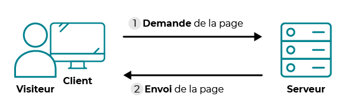
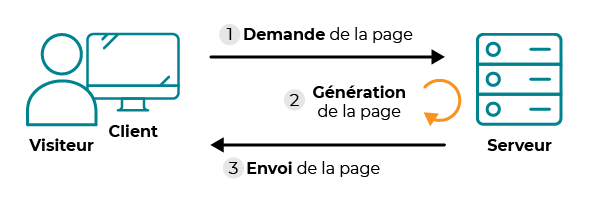

# Le dialogue client-serveur sur le Web

Sur Internet, on distingue deux catégories d'ordinateurs :
- les **clients** : les ordinateurs des internautes comme vous.
- les **serveurs** (Web): ce sont des ordinateurs puissants qui stockent (on dit aussi *hébergent*) et délivrent des sites Web aux internautes, c'est-à-dire aux clients.


Le World Wide Web utilise le **modèle client-serveur**. Il s'agit d'un mode d'échange de données dans lequel :

- les *clients* envoie des *requêtes*
- le *serveur* attend les requêtes des clients et y répond

Dans le cas du Web, c'est le protocole HTTP qui permet cet échange entre client et serveur, ou sa version sécurisée HTTPS.

# HTTP, le protocole du Web

Le protocole **HTTP** (*HyperText Transfer Protocol*, soit "protocole de transfert hypertexte") est un protocole de type client-serveur qui définit les messages envoyés entre le navigateur (client) et le serveur Web (serveur).

Les messages envoyés par le client sont appelés des **requêtes**, ceux envoyés en retour par le serveur sont appelés des **réponses**.


Concrètement le client va envoyer une requête au serveur pour accéder à une page Web et le serveur va lui répondre en lui envoyant la page Web.

## Déroulé d'une interaction client-serveur

Supposons qu'un navigateur fasse une requête pour accéder à la page `http://www.info-mounier.fr/premiere_nsi/essai.html`.

1. Le navigateur Web isole le nom du serveur `www.info-mounier.fr`
2. Le navigateur Web effectue une requête DNS pour obtenir l’adresse IP du serveur. Dans notre cas, l'adresse IP est `2001:8d8:100f:f000::20e` (IPv6).
3. Le navigateur Web se connecte à la machine dont l’adresse IP est `2001:8d8:100f:f000::20e`, en utilisant le protocole TCP sur le port 80.
4. Une fois la connexion établie, le navigateur Web peut effectuer la **requête** pour demander la ressource souhaitée (ici le document `/premiere_nsi/essai.html`). Concrètement, il envoit un certain nombre de messages au serveur en se conformant au protocole HTTP (on parle de *requête HTTP*).
5.	La **réponse** est envoyée au navigateur (on parle de *réponse HTTP*) qui parcourt le fichier et affiche la page correspondante.

# Requête HTTP et réponse du serveur

> ✍️ Faites l'activité 1 : <a href="Act1_RequetesReponsesHTTP.md" target="_blank">Analyse des réponses et requêtes HTTP</a>

## Requête HTTP

Une requête HTTP (client vers serveur) possède la syntaxe suivante :

- la première ligne s'appelle la **ligne de commande**, elle contient la méthode utilisée, l'URL de la ressource demandée et la version du protocole utilisée
- les lignes suivantes correpondent à toutes les **en-têtes de la requête** où l'on trouve : le nom du serveur, le client utilisé, le typde de document demandé, etc.
- une **ligne vide** pour séparer les en-têtes du corps de la requête (si le corps de la requête n'est pas vide)
- le **corps de la requête**

En naviguant vers `http://www.info-mounier.fr/premiere_nsi/essai.html`, le navigateur envoie la requête HTTP suivante :

```
GET /premiere_nsi/essai.html HTTP/1.1
Host: info-mounier.fr
User-Agent: Mozilla/5.0 (Windows NT 10.0; Win64; x64; rv:96.0) Gecko/20100101 Firefox/96.0
Accept: text/html,application/xhtml+xml,application/xml;q=0.9,image/avif,image/webp,*/*;q=0.8
Accept-Language: fr,fr-FR;q=0.8,en-US;q=0.5,en;q=0.3
Accept-Encoding: gzip, deflate
Connection: keep-alive
Upgrade-Insecure-Requests: 1
Pragma: no-cache
Cache-Control: no-cache
```

> Dans notre cas, le corps de la requête est vide mais ce n'est pas toujours le cas, en particulier lorsque le navigateur doit transmettre des paramètres au serveur (nous allons voir cela un peu plus tard).

### Les méthodes de requête HTTP

Il existe plusieurs méthodes pour une requête HTTP. Les plus importantes sont :

- `GET` : c’est la plus courante pour demander une ressource au serveur. Cette requête ne modifie pas la ressource.
- `HEAD` : cette méthode ne demande que des informations sur la ressource, sans demander la ressource elle-même.
- `POST` : Cette méthode est utilisée pour soumettre des données en vue d'un traitement côté serveur. C’est celle employée lorsque l'on envoie au serveur les données d'un formulaire (nous verrons cela plus tard)

## Réponse HTTP

Une réponse HTTP (serveur vers client) possède la syntaxe suivante :

- la première ligne s'appelle la *ligne de statut*, elle indique la version du protocole utilisée, le *code réponse* ainsi que le *texte réponse*.
- les lignes suivantes correspondent à toutes les *en-têtes de la réponse* où l'on trouve : le type de document envoyé, le type de serveur, les cookies éventuels, etc.
- une ligne vide pour séparer les en-têtes du corps de la réponse (si le corps de la réponse n'est pas vide)
- le *corps de la réponse* qui est le contenu de la ressource demandée

La réponse à la requête précédente ressemble à ceci :

```
HTTP/1.1 200 OK
Content-Type: text/html
Transfer-Encoding: chunked
Connection: keep-alive
Keep-Alive: timeout=15
Date: Sun, 06 Feb 2022 10:59:26 GMT
Server: Apache
Last-Modified: Mon, 15 Mar 2021 15:16:52 GMT
ETag: W/"159-5bd94bd53f5fa"
Content-Encoding: gzip

<!DOCTYPE html>
<html lang="fr">
  <head>
    <meta charset="UTF-8" />
    <title>Informatique au lycée Mounier ANGERS</title>
    <meta name="viewport" content="width=device-width, initial-scale=1.0" />
  </head>
  <body>
    <h1>Protocole HTTP</h1>
    <p>Ceci est une page pour comprendre le protocole <b>HTTP</b></p>
  </body>
</html>
```

> Ici, le corps de la réponse est le code HTML de la ressource demandée : `/premiere_nsi/essai.html`.

### Les différents codes de réponse

On peut trouver tous les codes de réponse possibles à l'adresse [https://developer.mozilla.org/fr/docs/Web/HTTP/Status](https://developer.mozilla.org/fr/docs/Web/HTTP/Status). Voici les plus importants :

- `200` : Lorsque la ressource est disponible, la requête est donc un succès. Le texte-réponse associé est « OK ».
- `404` : Lorsque la ressource est indisponible. Le texte-réponse associé est « NOT FOUND ».
- `403` : Lorsque la permission d’accéder à la ressource est refusée. Le texte-réponse associé est « FORBIDDEN ».
- `500` : Lorsque le serveur rencontre une erreur interne. Le texte réponse associé est « INTERNAL ERROR ».

## Échanges chiffrés avec HTTPS

Le protocole HTTP a un problème majeur : les données sont échangées « en clair ». Cela signifie que, n’importe qui ayant des droits suffisants sur une des machines par lesquelles transitent les requêtes et les réponses HTTP, peut intercepter les paquets échangés et connaître leurs contenus. Or, certaines données échangées sont très sensibles, comme un mot de passe, des coordonnées bancaires, ...

Il est important que les messages échangés contenant des données sensibles soient chiffrées. Dans ce cas, le client et le serveur utilisent le protocole **HTTPS** (pour *HyperText Transfer Protocol Secure*) pour communiquer. Ainsi, si un pirate informatique intercepte les paquets échangés, il ne pourra observer qu’une suite d’octets d’apparence aléatoire car seuls le client et le serveur sont capables de déchiffrer les paquets.

Le protocole HTTPS est la combinaison du protocole HTTP et d’un protocole de sécurisation des données échangées sur Internet (comme SSL ou TLS). Les pages chiffrées sont reconnaissables dans la barre d’adresse car leur URL commence toujours par `https://...` souvent précédé d'un pictogramme représentant un cadenas.


# Passage de paramètres à un site

## Site *statique* vs. site *dynamique*

Sur le Web, on trouve des sites *statiques* et des sites *dynamiques*. 

Un site statique est réalisé à l'aide des langages HTML, CSS et JavaScript (côté client) uniquement. Dans ce cas, tous les internautes demandant une page (par une requête HTTP) reçoivent le même contenu (réponse HTTP). On retrouve le schéma évoqué au début :



<p class="image-licence">Cas d'un site statique. Crédits : OpenClassrooms</p>

Le serveur stocke les pages web et les envoie aux clients qui les demandent, sans les modifier. Cela peut être adapté pour un site "vitrine" par exemple. 

De nos jours, la plupart des sites permettent l'interaction avec l'utilisateur (par un formulaire par exemple), on parle alors de sites *dynamiques*. Dans ce cas, il y a une étape intermédiaire entre la requête et la réponse : le serveur peut fabriquer la page demandée en fonction de certaines informations ou actions d'un utilisateur.



<p class="image-licence">Cas d'un site dynamique. Crédits : OpenClassrooms</p>

Les internautes demandant une page ne reçoivent pas tous le même contenu. Par exemple, lorsque vous vous connectez sur l'ENT vous demandez tous la même page Web mais chacun obtient une page d'accueil différente (qui dépend de votre nom, de votre classe, de vos matières, etc.).

## Fabrication d'une page par le serveur

Une page est *fabriquée* côté serveur par un langage de programmation (côté serveur) comme Python, PHP, Ruby, etc.

Nous allons voir dans l'activité 2 comment créer un site dynamique grâce au langage Python, et plus précisément avec le framework Flask.

> <span class="emoji">✍️</span> Faites l'activité 2 : <a href="Act2_DecouverteFlask.md" target="_blank">Découverte du framework Flask</a>.

Concrètement, les pages fabriquées par le serveur dépendent souvent des données transmises par l'utilisateur. En effet, **le client peut passer des paramètres au serveur lors de la requête HTTP** (étape 1 ci-dessus) :

- soit directement **via l’URL** (cf. paragraphe suivant) 
- soit en utilisant des éléments graphiques comme les **formulaires** permettant à l’utilisateur de saisir des valeurs et de les envoyer au serveur (cf. Chapitre 3 sur les formulaires et leur traitement).

Pour finir, nous abordons le passage de paramètres via l'URL.

## Passage de paramètres via l'URL

L'activité 3 montre comment on peut passer des paramètres à un serveur via l'URL (dans la requête HTTP) et comment le serveur peut récupérer et traiter ces informations de manière à construire la page Web qui sera renvoyée au client (réponse HTTP). La mise en oeuvre est faite avec Flask.

> <span class="emoji">✍️</span> Faites l'activité 3 : <a href="Act3_PassageParametresURL" target="_blank">Transmettre des paramètres dans l'URL</a>.

Le client peut passer des paramètres à un serveur via l'URL de la ressource demandée en utilisant un point d'interrogation `?` suivi des différents paramètres écrits sous la forme `nom=valeur`. S'il y a plusieurs paramètres, ceux-ci sont séparés par une esperluette `&`.

Ainsi, lorsque des paramètres sont transmis au serveur dans une URL, celle-ci possède la syntaxe suivante :

```
protocole://nom-ou-adresse:port/chemin?n1=v1&n2=v2&…&nk=vk
```

où `n1`, `n2`, ..., `nk` sont les noms des paramètres et `v1`, `v2`, ..., `vk` leurs valeurs respectives. Le `chemin` était aux origines du Web le chemin "physique" vers le fichier à qui sont transmises les données mais il ne correspond désormais plus toujours à une réalité "physique" mais plus à une abstraction gérée par le serveur comme une *route* associée à une fonction chargée de récupérer et traiter les données.

# Bilan

- Le **protocole HTTP** permet d'assurer les échanges entre **clients** et **serveurs** sur le Web.
- Un client envoie une **requête** HTTP au serveur qui lui envoie en retour une **réponse** HTTP avec la ressource demandée (si elle existe, sinon la réponse contient un code et un message d'erreur).
- De nos jours, la plupart des sites sont *dynamiques* : il y a une étape intermédiaire entre la requête et la réponse : le serveur peut fabriquer la page demandée en fonction de certaines informations ou actions d'un utilisateur. Cette "fabrication" est réalisée par un langage de programmation côté serveur.
- Par exemple, le protocole HTTP permet d'envoyer au serveur des *paramètres de requêtes* via l’URL ou via un formulaire (voir chapitre 3). Le serveur peut utiliser ces paramètres par fabriquer le contenu de la page à renvoyer au client.
- Le protocole HTTP transmet les paramètres *en clair* au serveur, ce qui n'assure aucune sécurité. Il faut utiliser le protocole HTTPS pour sécuriser les transmissions car ce dernier est couplé à une méthode de chiffrement des données (programme de Terminale).
- On a visualisé et mis en oeuvre ce dialogue entre client et serveur avec le framework Flask qui permet de créer facilement un serveur Web avec le langage Python.

---

Germain BECKER & Sébastien POINT, Lycée Emmanuel Mounier, ANGERS


