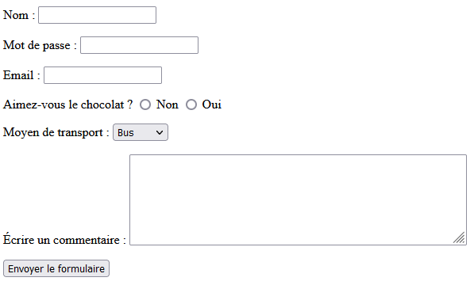
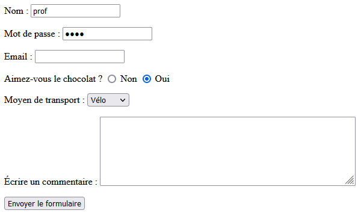

# Formulaire d'une page Web

Dans une page Web, un **formulaire** permet à un utilisateur de renseigner et transmettre des données au serveur, qui peut les utiliser pour :
- (construire et) renvoyer une page Web
- enregistrer les données dans un fichier, ou plus généralement dans une base de données

# Création d'un formulaire

<blockquote>
<p><span class="emoji">✍️</span> Regardez la vidéo suivante de 00:00 à 10:40 (<a href="https://youtu.be/FdA1P7dY_18" target="_blank">https://youtu.be/FdA1P7dY_18</a>)
</blockquote>

<div class="video-responsive">
    <iframe class="centre" width="560" height="315" src="https://www.youtube-nocookie.com/embed/FdA1P7dY_18?end=640" title="YouTube video player" frameborder="0" allow="accelerometer; autoplay; clipboard-write; encrypted-media; gyroscope; picture-in-picture" allowfullscreen></iframe>
</div>

Pour intégrer un formulaire dans une page Web, il suffit d'utiliser la balise `form` dans le fichier HTML.

Un formulaire est constitué :
- des différents éléments permettant de saisir des informations, sélectionner des options, téléverser des fichiers, etc.
- d'un bouton permettant de transmettre ces données au serveur, grâce au protocole HTTP (ou HTTPS)

Voici en vrac, quelques éléments de formulaires :

```html
<form action="" method="">
    <p>
        <!-- Champ de type "text" -->
        <label for="nom">Nom : </label>
        <input type="text" name="nom" id="nom">
    </p>
    <p>
        <!-- Champ de type "password" -->
        <label for="mdp">Mot de passe : </label>
        <input type="password" name="mdp" id="mdp">
    </p>
    <p>
            <!-- Champ de type "email" -->
        <label for="email">Email : </label>
        <input type="email" name="email" id="email">
    </p>
    <p>
        <!-- Champ de type "radio" -->
        Aimez-vous le chocolat ?
        <input type="radio" name="choix-chocolat" value="1" id="choix1">
        <label for="choix1">Non</label>
        <input type="radio" name="choix-chocolat" value="2" id="choix2">
        <label for="choix2">Oui</label>
    </p>
    <p>
        <!-- Choix dans une liste d'options avec la balise <select> -->
        <label for="moyen-transport">Moyen de transport : </label>
        <select name="transport" id="moyen-transport">
            <option value="bus">Bus</option>
            <option value="voiture">Voiture</option>
            <option value="velo">Vélo</option>
            <option value="autre">Autre</option>
        </select>
    </p>
    <p>
        <!-- Zone de texte plus grande avec la balise <textarea> -->
        <label for="commentaire">Écrire un commentaire : </label>
        <textarea name="commentaire" id="commentaire" rows="6" cols="50"></textarea>
    </p>
    <p>
        <!-- Bouton d'envoi du formulaire -->
        <input type="submit" value="Envoyer le formulaire">
        <!-- <button type="submit">Envoyer le formulaire</button> -->
    </p>
</form>
```

Et voici l'affichage à l'écran de ce formulaire dans un navigateur :



**Analyse** :

On a associé un *libellé* à chaque élément du formulaire grâce à l'élément `<label>`. Il constitue une sorte de légende ou description du champ. Cet élément est techniquement rattaché au champ de façon qu'un lecteur d'écran lirait le contenu du libellé lorsque le champ a le focus, et qu'un clic sur le libellé permet de donner le focus au champ associé.

Pour associer un élément `<label>` avec un élément `<input>`, il faut fournir un identifiant à l'élément `<input>` sous la forme d'un attribut `id`. Ensuite, on peut renseigner l'attribut `for` de l'élément `<label>` avec la valeur de cet identifiant.

**Remarques** :
- Il existe d'autres éléments de formulaire, vous en trouverez la liste complète en suivant ces liens si vous en avez besoin : 
    - les différents types de champs `<input>` : [https://developer.mozilla.org/fr/docs/Web/HTML/Element/Input](https://developer.mozilla.org/fr/docs/Web/HTML/Element/Input) 
    - tous les éléments de formulaire : [https://www.w3schools.com/html/html_form_elements.asp](https://www.w3schools.com/html/html_form_elements.asp)
- On peut ajouter un attribut `required` à tous les éléments obligatoires du formulaire. Le formulaire ne pourra pas être envoyé tant que tous les champs obligatoires ne sont pas renseignés. Néanmoins, comme il s'agit d'une vérification (du navigateur) côté client, n'importe qui peut retirer cet attribut : c'est pourquoi une vérification côté serveur est toujours nécessaire.

# Transmission des données au serveur Web

<blockquote>
<p><span class="emoji">✍️</span> Regardez la vidéo suivante de 10:40 à 19:00 (<a href="https://youtu.be/FdA1P7dY_18?t=640" target="_blank">https://youtu.be/FdA1P7dY_18?t=640</a>)
</blockquote>

<div class="video-responsive">
    <iframe class="centre" width="560" height="315" src="https://www.youtube-nocookie.com/embed/FdA1P7dY_18?start=640&end=1140" title="YouTube video player" frameborder="0" allow="accelerometer; autoplay; clipboard-write; encrypted-media; gyroscope; picture-in-picture" allowfullscreen></iframe>
</div>

Les données d'un formulaire sont transmises au serveur lorsque l'utilisateur clique sur le bouton d'envoi du formulaire. Pour cela, il est nécessaire de définir les deux attributs `action` et `method` de l'élément `<form>`.

## Les attributs `action` et `method`

La valeur de l'attribut `action` est l'URL où doivent être envoyées les données collectées par le formulaire.

La valeur de l'attribut `method` définit la méthode HTTP utilisée pour envoyer les données : cela peut être `GET` ou `POST`.

Par exemple, si on veut transmettre les données du formulaire à l'URL `/ma-page-de-traitement` de notre site en utilisant la méthode `POST`, alors on écrira :

```html
<form action="/ma-page-de-traitement" method="POST">
    <!-- tous les éléments du formulaire -->
<form>
```

## La méthode `GET`

La méthode `GET` transmet les données du formulaire via l'URL, comme nous l'avons vu dans l'activité sur le passage de paramètres via l'URL.

Par exemple, si on complète le formulaire précédent de la façon suivante



alors les données sont transmises dans l'URL comme suit :

```
/ma-page-de-traitement?nom=prof&mdp=1234&email=&choix-chocolat=2&transport=velo&commentaire=
```

Dans ce cas, la première ligne (la *ligne de commande*) d'en-tête de la requête `GET` est de la forme

```
GET /ma-page-de-traitement?nom=prof&mdp=1234&email=&choix-chocolat=2&transport=velo&commentaire= HTTP/1.1
```

et le corps de la requête est vide.

**Analyse** : Il est important de noter que :
- les noms des paramètres correspondent aux valeurs des attributs `name` des éléments du formulaire (`nom`, `mdp`, `email`, `choix-chocolat`, `transport` et `commentaire`)
- les valeurs des paramètres correspondent aux informations saisies par l'utilisateur ou aux valeurs des attributs `value` selon les éléments du formulaire

**Quand utiliser `GET` ?**

Comme les données sont visibles dans l'URL, cette méthode est adaptée uniquement si les données transmises ne sont pas à caractère confidentiel. De plus, comme nous l'avons déjà dit, les URL ayant une taille maximale, il ne faut pas non plus que les valeurs transmises soient trop longues.

## La méthode `POST`

La méthode `POST` quant à elle, transmet les données au serveur dans le corps de la requête. Concrètement, cela signifie que les données ne sont pas visibles dans l'URL mais qu'elles sont bien présentes dans le corps de la requête. Ainsi, si on transmet le formulaire précédent avec la méthode `POST`, la requête envoyée au serveur est de cette forme :

```
POST /ma-page-de-traitement HTTP/1.1
...
puis toutes les en-têtes
...
[ ligne vide ]
nom=prof&mdp=1234&email=&choix-chocolat=2&transport=velo&commentaire=
```

><span style="font-size:1.5em;">⚠️</span> Cette méthode `POST` ne permet pas de transmettre les données de manière chiffrée : n'importe qui interceptant le paquet correspondant à la requête aurait accès aux données transmises. Pour que la transmission soient sécurisée il faut combiner la méthode `POST` avec le  protocole sécurisé HTTPS qui dispose d'une couche de chiffrement (comme SSL ou TLS). Dans ce cas, les données sont toujours présentes dans le corps de la requête mais ont été chiffrées et sont donc inexploitables pour quiconque les récupérerait... (ceci est au programme de Terminale).

**Quand utiliser `POST` ?**

C'est la méthode à utiliser lorsque les données à transmettre sont à caractère confidentiel (à combiner avec un protocole chiffré !). Les données transmises peuvent avoir un longueur importante car elles sont dans le corps de la requête et ne sont plus soumises à une taille maximale autorisée d'URL.

C'est aussi la méthode à utiliser lorsque la requête entraîne des modifications sur le serveur (par exemple, dans un fichier du serveur ou dans la base de données du site) : une publication sur un blog, un validation d'achat sur un site de commerce, etc. Il faut d'ailleurs faire attention à ne pas actualiser une telle requête, car celle-ci serait envoyée deux fois au serveur, avec le risque de payer deux fois une commande !

# Traitement des données d'un formulaire côté serveur

Un serveur Web peut récupérer et exploiter les données d'un formulaire. Vous allez voir comment en faisant l'activité suivante :


<blockquote>
<p><span class="emoji">✍️</span> Faites l'activité <a href="Act_TraitementFormulaire.md" target="_blank">Traitement des données d'un formulaire avec Flask</a>.
</blockquote>

# Bilan

- Un formulaire est un élément HTML que l'on crée avec la balise `<form>`. Il existe beaucoup d'éléments de formulaires, chacun ayant un objectif précis et particulier.
- Les formulaires sont devenus des éléments indispensables pour les applications Web car ils permettent aux utilisateurs d'envoyer des données au serveur, indispensables pour le fonctionnement de la plupart des sites Web actuels.
- Ces données peuvent être envoyées avec la méthode GET ou avec la méthode POST, chacune ayant ses avantages et ses inconvénients.
- La méthode GET transmet les données d'un formulaire au serveur directement via l'URL, ce qui la rend inadaptée à des transmissions de données sensibles.
- La méthode POST transmet les données dans le corps de la requête, mais cela n'en fait pas pour autant un moyen sécurisé de transmission des données. Pour cela, il faudrait coupler la méthode POST avec le protocole HTTPS qui permet de chiffrer les données transmises (pas au programme de Première NSI).
- Le serveur peut récupérer les données d'un formulaire et les exploiter pour construire une page de réponse à renvoyer à l'utilisateur.
- L'activité proposée avec le framework Flask a permis de mettre en oeuvre l'envoi, la récupération et le traitement de données d'un formulaire côté serveur, ainsi que la construction d'une page de réponse.

---

**Références**

- Manuel *Numérique et Sciences Informatiques*, niveau Première, T. BALABONSKI, S. CONCHON, J.-C. FILLIATRE, K. NGUYEN, éditions Ellipses.
- Cours de Gilles Lassus sur les requêtes GET et POST : [https://glassus.github.io/premiere_nsi/T6_IHM_Web/6.3_Get_Post_Formulaires/cours/](https://glassus.github.io/premiere_nsi/T6_IHM_Web/6.3_Get_Post_Formulaires/cours/)
- Cours OpenClassrooms *Concevez votre site Web avec PHP et MySQL* : [https://openclassrooms.com/fr/courses/918836-concevez-votre-site-web-avec-php-et-mysql/4237646-decouvrez-le-fonctionnement-dun-site-ecrit-en-php](https://openclassrooms.com/fr/courses/918836-concevez-votre-site-web-avec-php-et-mysql/4237646-decouvrez-le-fonctionnement-dun-site-ecrit-en-php). 

---

Germain BECKER & Sébastien POINT, Lycée Emmanuel Mounier, ANGERS


