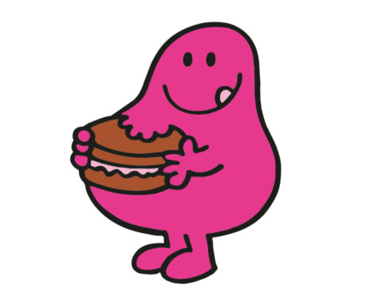

# Algorithmes gloutons

>*greedy algorithms* en anglais, l'adjectif "greedy" signifiant avare/glouton.



Les *algorithmes gloutons* forment une catégorie d'algorithmes permettant de donner une solution à des problèmes d'optimisation qui visent à maximiser/minimiser une quantité (**plus court** chemin (GPS), **plus petit** temps d'exécution, **meilleure** organisation d'un emploi du temps, etc.)

Le principe d'un algorithme glouton est le suivant :
- résoudre un problème étape par étape
- à chaque étape, faire le choix optimal de moindre coût (de meilleur gain)

Le choix effectué à chaque étape n'est jamais remis en cause, ce qui fait que cette stratégie permet d'aboutir rapidement à une solution au problème de départ. C'est en ce sens que l'adjectif *greedy* (glouton/avare) caractérise ces algorithmes : il terminent rapidement (*glouton*) sans fournir beaucoup d'efforts (*avare*).

## Le problème du rendu de monnaie

### Enoncé

Vous êtes commerçant et devez rendre de la monnaie à vos clients de façon optimale, c'est-à-dire avec le **nombre minimal** de pièces et de billets.

-   On suppose que les clients ne vous donnent que des sommes entières en euros (pas de centimes pour simplifier).
-   Les valeurs des pièces et billets à votre disposition sont : 1, 2, 5, 10, 20, 50, 100, 200 et 500. On suppose que vous avez autant d'exemplaires de chaque pièce et billet
-   Dans la suite, afin de simplifier, nous désignerons par "pièces" à la fois les pièces et les billets.

### Stratégie à adopter

_Exemple_ : Myriam vous achète un objet qui coûte 53 euros. Elle paye avec un billet de 200 euros. Vous devez donc lui rendre 147 euros. La meilleure façon de lui rendre la monnaie est de le faire avec un billet de 100, deux billets de 20, un billet de 5 et une pièce de 2.

Pour minimiser le nombre de pièces à rendre, il apparaît la stratégie suivante :
- on commence par rendre la pièce de la plus grande valeur possible
- on déduit cette valeur de la somme (encore) à rendre
- on recommence, jusqu'à obtenir une somme nulle

En procédant ainsi, on se rend compte que l'on résout le problème étape par étape et qu'un choix optimal est fait à chaque étape (la pièce de plus grande valeur). Cette stratégie entre donc bien dans la catégorie des *algorithmes gloutons*.

### Implémentation en Python

On peut implémenter cet algorithme avec une fonction de deux paramètres : la somme `s` à rendre et le tableau `pieces` contenant les valeurs des pièces à disposition rangées dans l'ordre croissant.

Pour commencer, on se place sur la plus grande pièce et on reprend la stratégie précédente en plaçant au fur et à mesure les pièces à rendre dans une liste `solution`. Ne sachant pas à l'avance combien d'étapes seront nécessaires on utilise de manière logique une boucle `while` qui s'arrêtera lorsque toute la somme sera rendue (ou que toutes les pièces ont été testées).


```python
def rendu_monnaie_glouton(s, pieces):
        """Renvoie la solution gloutonne du rendu de monnaie d'une somme s entière et positive. 
        Le tableau pieces contient les valeurs des pièces à disposition dans l'ordre décroissant."""
        solution = []
        i = 0 # position de la première pièce à tester (la plus grande)
        while s > 0 and i < len(pieces): # tant qu'il reste de l'argent à rendre et que toutes les pièces n'ont pas été testées
            valeur = pieces[i] # on prend la pièce d'indice i
            if valeur <= s: # s'il est possible de rendre la pièce
                solution.append(valeur) # on l'ajoute à solution
                s = s - valeur # et on déduit sa valeur de la somme à rendre
            else:
                i = i + 1 # sinon on passe à la pièce immédiatement inférieure
        return solution
```

On peut alors tester l'exemple donné au départ.


```python
euros = [500, 200, 100, 50, 20, 10, 5, 2, 1]
rendu_monnaie_glouton(147, euros)
```


    [100, 20, 20, 5, 2]


## Optimalité d'un algorithme glouton

La stratégie gloutonne consiste à trouver la **solution optimale _locale_** à chaque étape, dans l'espoir de trouver la **solution optimale _globale_**.

On peut se demander si cette stratégie donne nécessairement la meilleure solution globale, autrement dit si la solution globale obtenue est la meilleure ? Voici quelques exemples pour répondre à cette question.

### Un exemple simple

* On part du point O. 
* On doit atteindre le plus rapidement possible tous les points A, B, C, D, E, F. 
* L'ordre de parcours des points n'est pas important.


En appliquant la stratégie gloutonne, à chaque étape on doit aller vers le point le plus proche. Ainsi, en partant de O, on va en E, puis en B, puis en A, puis en C, puis en F et enfin en D (car il ne reste plus que D).

**Est-ce la meilleure solution ?** 

La réponse est NON. En effet, le chemin suivant permet d'atteindre tous les points plus rapidement :


Voici donc un exemple pour lequel le meilleur choix local n'aboutit pas à la meilleure solution globale.

### Rendu de monnaie

Ce n'est pas évident à montrer, mais l'algorithme glouton fournit bien la solution optimale au problème du rendu de monnaie... dans le cas où le système de monnaie est l'euro.

**Et pour un autre système de monnaie ?** 

Imaginons qu'il faille rendre la somme 8 avec à notre disposition les pièces `[6, 4, 1]`. 

>**Questions**
1. Quelles pièces sont rendues en appliquant l'algorithme glouton ? Combien y a-t-il de pièces rendues ?
2. Trouvez une meilleure solution pour optimiser le nombre de pièces rendues.

L'algorithme glouton donne la solution `[6, 1, 1]` donc rend trois pièces. Ce n'est la pas la solution optimale car `[4, 4]` permet de rendre 8 avec seulement deux pièces.

*Moralité :* l'algorithme glouton ne donne pas nécessairement une solution optimale dans le rendu de monnaie, cela dépend du système monétaire.

**Et si on n'a pas de pièce *unité* ?**

Imaginons qu'il faille rendre la somme 8 avec à notre disposition les pièces `[5, 2]`.

>**Questions**
1. Quelles pièces sont rendues en appliquant l'algorithme glouton ?
2. Que constatez-vous ?

L'algorithme glouton rend la pièce 5, puis la pièce 2, puis ... on est coincés car il n'y a pas de pièce unité. On constate que l'algorithme glouton ne donne pas une solution exacte. Pourtant, il en existe une : `[2, 2, 2, 2]`.

*Moralité :* l'algorithme glouton ne donne pas toujours une solution exacte au problème.

On peut vérifier les réponses précédentes en appellant notre fonction.


```python
rendu_monnaie_glouton(8, [6, 4, 1])  # solution non optimale trouvée
```


    [6, 1, 1]


```python
rendu_monnaie_glouton(8, [5, 2])  # solution incorrecte trouvée
```


    [5, 2]


> **Remarque**: dans la fonction `rendu_monnaie_glouton`, la deuxième condition, `i < len(pieces)`, de la boucle `while` n'est pas obligatoire dans le cas du système des euros car celui-ci dispose d'une pièce unité qui garantit le rendu exact de n'importe quelle somme (et donc l'arrêt de la boucle par la première condition). Elle a été ajoutée pour faire face aux cas où l'algorithme glouton ne fournit pas une solution correcte. Nous ne rentrerons pas davantage dans les détails ici, mais sans cette seconde condition, l'appel `rendu_monnaie_glouton(8, [5, 2])` aurait levée une erreur.

## Le problème du sac à dos (version Lupin)

>*Knapsack Problem* en anglais, souvent abrégé **KP**.


### Enoncé possible

Vous êtes un voleur et souhaitez emporter les objets pour maximiser la valeur totale du butin. Cependant, votre sac ne peut supporter qu'une masse maximale de 10 kg.  On dispose d’un sac pouvant supporter un poids maximal donné et de divers objets ayant chacun une valeur et un poids. Il s’agit de choisir les objets à emporter dans le sac afin maximiser la valeur totale tout en respectant la contrainte du poids maximal. C’est un problème d’*optimisation avec contrainte*.

Considérons les objets suivants et un sac de capacité maximale 10 kg. Quels objets faut-il prendre ?

| objet       |  A  |  B  |  C  |  D  |  E  |  F  |
|:------:     |:---:|:---:|:---:|:---:|:---:|:---:|
|  masse (kg) |  7  |  6  |  4  |  3  |  2  |  1  |
| valeur (€)  |9100 |7200 |4800 |2700 |2600 |200  |

### Stratégies gloutonnes

Il y a plusieurs choix possibles :
- **Stratégie 1** : prendre toujours l'objet de plus grande valeur n'excédant pas la capacité restante (il faut trier préalablement par valeur décroissante)
- **Stratégie 2** : prendre toujours l'objet de plus faible masse (il faut trier préalablement par masse croissante)
- **Stratégie 3** : prendre toujours l'objet de plus grand rapport $\frac{\text{valeur}}{\text{masse}}$ n'excédant pas la capacité restante (il faut trier préalablement par rapport $\frac{\text{valeur}}{\text{masse}}$ décroissant)

> Essayez d'appliquer les trois stratégies à notre exemple. Y a-t-il une stratégie meilleure qu'une autre ?

**Réponse** :
- La stratégie 1 (choix par valeur décroissante) donne le sac $\{A, D\}$ d'une valeur de 11800 €.
- La stratégie 2 (choix par masse croissante) : donne le sac $\{F, E, D, C\}$ d'une valeur de 10300 €.
- Pour la stratégie 3 (choix par par rapport $\frac{\text{valeur}}{\text{masse}}$ décroissant) il faut d'abord calculer les rapports en question pour chaque objet (donnés dans le tableau ci-dessous). Cette stratégie donne le sac $\{A, E, F\}$ d'un valeur de 11900 €.

| objet       |  A  |  B  |  C  |  D  |  E  |  F  |
|:------:     |:---:|:---:|:---:|:---:|:---:|:---:|
|  $\frac{\text{valeur}}{\text{masse}}$ (€/kg) |  1300 |  1200  |  1200  |  900  | 1300   | 200 |

On constate donc que *pour cet exemple*, la stratégie n°3 est la meilleure. Mais on peut faire mieux ! En effet, le sac $\{B, C\}$ fait 10 kg et possède une valeur de 12000 €. Il s'agit de la solution optimale au problème.

#### Moralité

On constate que la qualité de la solution dépend de la stratégie gloutonne utilisée. Selon les exemples, c'est l'une ou l'autre qui sera meilleure. Cependant, cette solution n'est pas forcément la solution optimale.

### Implémentation en Python

Faite en exercices.

## Pourquoi se contenter d'une solution non optimale ?

Comme nous venons de le voir dans les deux problèmes du rendu de monnaie et du sac à dos, la stratégie gloutonne ne donne pas forcément un résultat optimal. On peut alors se demander s'il n'est pas possible de trouver la meilleure solution, à coup sûr, pour résoudre un problème d'optimisation. 

Une telle approche existe, il s'agit de la stratégie de *force brute* (ou *énumérative*) qui consiste à passer en revue toutes les options possibles et retenir la meilleure.

>Pourquoi n'utilise-t-on pas toujours la *force brute* ?

Le plus simple est de l'expliquer sur un exemple : prenons le problème du sac à dos. 

Chaque objet est pris ou pas : il s'agit donc d'une donnée binaire. Avec 3 objets, il y a donc $2^3$ combinaisons d'objets possibles, c'est-à-dire 8, ce qui est tout à fait acceptable. 

De manière générale, avec $n$ objets, il y aurait $2^n$ combinaisons à énumérer et tester. On obtient une complexité dite *exponentielle* et c'est là le problème : avec 80 objets, on obtient $2^{80}$ combinaisons à tester, c'est-à-dire environ $10^{24}$ combinaisons, soit de l'ordre de grandeur du nombre d'étoiles dans l'Univers observable, ou de gouttes d'eau dans la mer, ou du nombre de grains de sables au Sahara... (référence : https://fr.wikipedia.org/wiki/Ordres_de_grandeur_de_nombres). 

La stratégie *force brute* est donc inapplicable si trop d'objets sont en jeu. Il en est de même pour les autres problèmes d'optimisation dès que le taille des données est trop importante.

## Autres problèmes classiques

Il existe de nombreux autres problèmes d'optimisation pouvant être résolu par un algorithme glouton (pas forcément de manière optimale) :
- problème du voyageur (plus court chemin)
- coloration d'un graphe
- coloriage de carte (voir le deuxième exemple de cette [vidéo](https://peertube.lyceeconnecte.fr/videos/watch/8a121d63-49c7-49d9-aab0-5d823b44b11d))
- organisation (de planning)
- ...

Certains sont abordés dans les exercices.

## Conclusion

- Nous avons vu que les algorithmes gloutons fournissent une stratégie pour résoudre des problèmes d'optimisation : à chaque étape, faire le meilleur choix (local). 
- Ils donnent rapidement une *solution satisfaisante* à un problème mais pas nécessairement la *solution optimale* puisque les choix successifs ne sont jamais remis en cause.
- La stratégie de *force brute* permettrait à coup sûr d'obtenir une solution optimale mais devient inapplicable dès que la taille des données est trop importante. C'est pourquoi une solution gloutonne est parfois privilégiée.
- Il existe d'autres méthodes algorithmiques pour résoudre des problèmes d'optimisation : celles-ci seront abordées en Terminale.

---

**Références :**
- Documents ressources du DIU EIL, Université de Nantes, C. JERMANN.
- Prepabac, spécialité NSI 1ère, C. ADOBET, G. CONNAN, G. ROZSAVOLGYI, L. SIGNAC.
- Numérique et Sciences Informatiques, 1re, T. BALABONSKI, S. CONCHON, J.-C. FILLIATRE, K. NGUYEN, éditions ELLIPSES : [Site du livre](https://www.nsi-premiere.fr/)
- Cours de G. LASSUS sur les algorithmes gloutons : [lien Github vers son notebook](https://github.com/glassus/nsi/blob/master/Premiere/Theme05_Algorithmique/06_Algorithmes_gloutons.ipynb)
- Ressources Eduscol : [Algorithmes gloutons](https://cache.media.eduscol.education.fr/file/NSI/76/4/RA_Lycee_G_NSI_algo-gloutons_1170764.pdf) et [Le problème du sac à dos](https://cache.media.eduscol.education.fr/file/NSI/76/5/RA_Lycee_G_NSI_algo-sac-a-dos_1170765.pdf)

---
Germain BECKER, Lycée Mounier, ANGERS 
