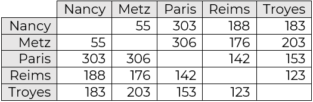

# Algorithmes gloutons - EXERCICES

Un algorithme glouton permet d'apporter une solution à un problème d'optimisation (*maximiser* ou *minimiser* une grandeur) tout en respectant certaines *contraintes*.


## Exercice 1

On cherche à sélectionner cinq nombres de la liste suivante en cherchant à avoir leur somme la plus grande possible (maximiser une grandeur) et en s'interdisant de choisir deux nombres voisins (contrainte).

`15 - 4 - 20 - 17 - 11 - 8 - 11 - 16 - 7 - 14 - 2 - 7 - 5 - 17 - 19 - 18 - 4 - 5 - 13 - 8`


Comme on souhaite avoir le plus grand résultat final, la stratégie gloutonne consiste à choisir à chaque étape le plus grand nombre possible dans les choix restants.

1. Appliquez cet algorithme glouton sur le tableau.
2. Vérifiez que $\{20, 18, 17, 16, 15\}$ est une autre solution possible.
3. Que dire de la solution gloutonne ?

## Exercice 2 : le problème du voyageur

Un voyageur a ciblé plusieurs villes qu'il souhaite visiter. Il cherche un itinéraire passant par toutes ces villes et qui minimise la distance totale parcourue. Les villes peuvent être visitées dans n'importe quel ordre mais aucune ne doit être négligée, et le visiteur doit revenir à la fin à sa ville de départ.

Le voyageur part de Nancy et souhaite visiter Metz, Paris, Reims et Troyes, avant de retourner à Nancy.

Voici un tableau donnant les distances kilométriques entre chacune des ces villes.



1. Quelle est la stratégie gloutonne à mettre en oeuvre ?
2. Mettez en oeuvre cette stratégie et donnez la solution.
3. Calculez la distance totale pour le parcours Metz - Reims - Paris - Troyes (départ et arrivée à Nancy sous-entendus)
4. Que dire de la solution gloutonne ?

## Exercice 3 : le problème du sac à dos

On rappelle qu'il y a plusieurs stratégies gloutonnes pour donner une solution à ce problème

- **Stratégie 1** : prendre toujours l'objet de plus grande valeur n'excédant pas la capacité restante (il faut trier préalablement par valeur décroissante)
- **Stratégie 2** : prendre toujours l'objet de plus faible masse (il faut trier préalablement par masse croissante)
- **Stratégie 3** : prendre toujours l'objet de plus grand rapport $\frac{\text{valeur}}{\text{masse}}$ n'excédant pas la capacité restante (il faut trier préalablement par rapport $\frac{\text{valeur}}{\text{masse}}$ décroissant)

### Exemple 1

Considérons les objets suivants et un sac de capacité maximale 2 kg.

| objet  |  A  |  B  |  C  |
|:------:|:---:|:---:|:---:|
|  masse (kg) |  1,5 |  2 |  0,3  |
| valeur (€) | 200 | 500 | 400 |
|  $\frac{\text{valeur}}{\text{masse}}$ | 133,33... | 250 | 1333,33... |

1. Appliquez chacune des stratégies à ce problème.
2. Quelle est la meilleure stratégie dans ce cas ?
3. Listez toutes les combinaisons possibles, puis celles respectant la contrainte et déduisez-en la solution optimale au problème. Comparez-la aux stratégies gloutonnes.

### Exemple 2

Même questions mais avec un sac de capacité maximale 3,5 kg.


### Exemple 3

On considère désormais les objets suivants et un sac de capacité maximale 5 kg.

| Objet 	| Valeur (en milliers d'€) 	| Masse (en kg) |
|:---------:	|:-------:	|:---------:	|
| A 	| 114   	| 4.57 	|
| B 	| 32    	| 0.63  |
| C 	| 20    	| 1.65 	|
| D 	| 4     	| 0.085 |
| E 	| 18    	| 2.15 	|
| F 	| 80    	| 2.71 	|
| G 	| 5     	| 0.32  |

1. Appliquez chacune des stratégies à ce problème.
2. Quelle est la meilleure stratégie dans ce cas ?
3. Le sac $\{B, C, F\}$ est-il une solution au problème ? Quelle est sa valeur ? Que dire des solutions gloutonnes ?

## Exercice 4

Vous visitez un parc d'attractions proposant des spectacles à différents horaires. Voici les horaires des différents spectacles : 

| spectacle  |  A  |  B  |  C  | D | E | F | G | H | I | J |
|----|:---:|:---:|:---:|:---:|:---:|:---:|:---:|:---:|:---:|:---:|
| horaire | 10h-11h | 10h30-11h30 | 11h-12h30 | 11h30-12h | 12h-13h | 13h-15h | 13h30-14h | 14h-15h30 | 15h-16h | 16h-17h30 |

Vous avez remarqué qu'il n'est pas possible d'assister à tous les spectacles puisque certains ont lieu à des moments communs. Vous souhaitez assister à un maximum de spectacles sur la journée. Quels spectacles devez-vous choisir ?

Voici deux stratégies gloutonnes possibles :

- Stratégie n°1 : choisir le spectacle dont l'heure de début arrive le plus tôt (parmi les spectacles dont l'heure de début est postérieure aux créneaux des spectacles déjà choisis). Cette stratégie est basée sur l'idée que moins on attend entre deux spectacles, plus on en verra.
- Stratégie n°2 : choisir le spectacle dont l'heure de fin arrive le plus tôt (parmi les spectacles dont l'heure de début est postérieure aux créneaux des spectacles déjà choisis). Cette stratégie est basée sur l'idée que plus un spectable finit tôt, plus il reste de temps pour en voir d'autres.

1. Appliquez ces deux stratégies au problème.
2. Laquelle donne la meilleure solution ?

>**Remarque** : la deuxième stratégie gloutonne donne toujours la solution optimale à ce type de problème.

## Exercice 5 : Plus beaucoup de place sur ta clé USB ?

>**Objectifs** : 
- implémenter un algorithme glouton pour trouver une solution à un problème
- implémenter l'algorithme de *force brute* pour déterminer la solution optimale et la comparer à la solution gloutonne

### Introduction

Nous disposons d’une clé USB qui est déjà bien remplie et sur laquelle il ne reste que 5 Go de libre. Nous souhaitons copier sur cette  clé  des  fichiers  vidéos  pour  l’emporter  en  voyage.  Chaque  fichier  a  un poids  et  chaque  vidéo  a  une  durée.  La  durée  n’est pas proportionnelle à la taille car les fichiers sont de format différents, certaines vidéos sont de grande qualité, d’autres sont très compressées. Le tableau qui suit présente les 7 fichiers disponibles avec les durées données en minutes.

| Nom 	| Durée en min (valeur) 	| Poids |
|---------	|-------	|---------	|
| Vidéo A 	| 114   	| 4.57 Go 	|
| Vidéo B 	| 32    	| 630 Mo  	|
| Vidéo C 	| 20    	| 1.65 Go 	|
| Vidéo D 	| 4     	| 85 Mo   	|
| Vidéo E 	| 18    	| 2,15 Go 	|
| Vidéo F 	| 80    	| 2,71 Go 	|
| Vidéo G 	| 5     	| 320 Mo  	|

>**Problème** : Quelles vidéos copier sur la clé USB pour que la durée des vidéos soient la plus grande possible tout en ne dépassant pas 5 Go ?

**Question 1** : Quelle est la valeur que l'on cherche à maximiser/minimiser ? Quelle est la contrainte ?

Réponse : 

**Question 2** : Quel problème reconnaissez-vous ici ?

Réponse : 

Vous allez implémenter (= programmer) une solution gloutonne pour résoudre ce problème, puis vous implémenterez l'algorithme de *force brute* qui donnera la solution optimale au problème. La **stratégie gloutonne retenue sera de toujours prendre la vidéo de plus grande durée** n'excédant pas la capacité restante de poids.

### Représentation des données

Dans la suite, on utilisera des dictionnaires de la forme suivante pour représenter chaque vidéo, la durée étant donnée minute et le poids étant donné en Go.

```python
{'nom': 'Vidéo A', 'duree': 114, 'poids': 4.57}
```

On peut alors mémoriser les 7 vidéos dans le tableau `table_videos` suivant.


```python
table_videos = [{'nom' : 'video A', 'duree' : 114, 'poids' : 4.57},
                {'nom' : 'video B', 'duree' : 32, 'poids' : 0.63},
                {'nom' : 'video C', 'duree' : 20, 'poids' : 1.65},
                {'nom' : 'video D', 'duree' : 4, 'poids' : 0.085},
                {'nom' : 'video E', 'duree' : 18, 'poids' : 2.15},
                {'nom' : 'video F', 'duree' : 80, 'poids' : 2.71},
                {'nom' : 'video G', 'duree' : 5, 'poids' : 0.32}]
```

On peut alors accéder aux éléments de cette table.


```python
table_videos[0]['nom']
```


    'video A'


```python
table_videos[3]['duree']
```


    4


```python
table_videos[6]['poids']
```


    0.32


### Ecriture des fonctions utiles

#### Accès au poids d'une vidéo

Pour résoudre le problème, on a besoin d'accéder au poids des vidéos pour vérifier la contrainte du poids maximal. La fonction suivante permet de renvoyer le poids d'une vidéo entrée en paramètre (sous la forme d'un dictionnaire comme vu précédemment). Quelques assertions devant être vérifiées par la fonction ont été écrites.


```python
def poids(video):
    return video['poids']

assert poids({'nom' : 'video A', 'duree' : 114, 'poids' : 4.57}) == 4.57
assert poids({'nom' : 'video D', 'duree' : 4, 'poids' : 0.085}) == 0.085
assert poids({'nom' : 'video G', 'duree' : 5, 'poids' : 0.32}) == 0.32
```

#### Accès à la durée d'une vidéo

De même, comme la stratégie gloutonne choisie prévoit de prendre la vidéo de plus grande durée (valeur) n'excédant pas la capacité restante de poids, il est nécessaire de pouvoir accéder aux durées de chacune des vidéos retenues.

**Question 2** : Ecrivez une fonction `duree(video)` qui renvoie la durée (= valeur) d'une video entrée en paramètre (sous la forme d'un dictionnaire vu précédemment). Quelques assertions devant être vérifiées par votre fonction sont données ci-dessous.


```python
def duree(video):
    # à compléter

```


```python
assert duree({'nom' : 'video A', 'duree' : 114, 'poids' : 4.57}) == 114
assert duree({'nom' : 'video D', 'duree' : 4, 'poids' : 0.085}) == 4
assert duree({'nom' : 'video G', 'duree' : 5, 'poids' : 0.32}) == 5
```

#### Calculer le poids total et la durée totale d'une table de vidéos

Enfin, il sera nécessaire de pouvoir calculer le poids et la durée totale d'une table de vidéos pour savoir si la contrainte de capacité maximale est respectée d'une part, et pour connaître la durée totale qui est la valeur à maximiser.

**Question 3** : Ecrivez une fonction `poids_total(table_videos)` qui renvoie le poids total `poids_t` des vidéos présentes dans `table_videos`. Quelques assertions devant être vérifiées par votre fonction sont données ci-dessous.


```python
def poids_total(table_videos):
    poids_t = 0
    # à compléter

    
    return poids_t
```


```python
table1 = [{'nom' : 'video C', 'duree' : 20, 'poids' : 1.65}]
table2 = [{'nom' : 'video A', 'duree' : 114, 'poids' : 4.57},
           {'nom' : 'video B', 'duree' : 32, 'poids' : 0.63}]
table3 = [{'nom' : 'video A', 'duree' : 114, 'poids' : 4.57},
          {'nom' : 'video B', 'duree' : 32, 'poids' : 0.63},
          {'nom' : 'video C', 'duree' : 20, 'poids' : 1.65}]

assert poids_total(table1) == 1.65   # on compare des nombres réels mais on a pris soin de bien choisir les exemples
assert poids_total(table2) == 5.2
assert poids_total(table3) == 6.85
assert poids_total([]) == 0   # table vide testée
```

**Question 4** : Ecrivez une fonction `duree_totale(table_videos)` qui renvoie la durée totale `duree_t` des vidéos présentes dans `table_videos`. Quelques assertions devant être vérifiées par votre fonction sont données ci-dessous.


```python
def duree_totale(table_videos):
    duree_t = 0
    # à compléter

    
    return duree_t
```


```python
table1 = [{'nom' : 'video C', 'duree' : 20, 'poids' : 1.65}]
table2 = [{'nom' : 'video A', 'duree' : 114, 'poids' : 4.57},
           {'nom' : 'video B', 'duree' : 32, 'poids' : 0.63}]
table3 = [{'nom' : 'video A', 'duree' : 114, 'poids' : 4.57},
          {'nom' : 'video B', 'duree' : 32, 'poids' : 0.63},
          {'nom' : 'video C', 'duree' : 20, 'poids' : 1.65}]

assert duree_totale(table1) == 20
assert duree_totale(table2) == 146
assert duree_totale(table3) == 166
assert duree_totale([]) == 0   # table vide testée
assert duree_totale(table_videos) == 273 # table avec toutes les vidéos
```

### Implémentation de l'algorithme glouton

#### Tri préalable

Comme la stratégie gloutonne retenue prévoit de choisir les vidéos de plus grande durée n'excédant pas la capacité restante, il est judicieux de commencer par trier les vidéos de `table_videos` par durée décroissante.

**Question 5** : Utilisez la fonction `sorted` de Python pour obtenir un *nouveau* tableau (appelé `table_triee`) contenant les vidéos de `table_videos` triées par durée décroissante. *Indication* : l'instruction `help(sorted)` permet d'afficher l'aide de la fonction `sorted` (vous pouvez aussi revoir le cours sur les tris de table si nécessaire).


```python
# à compléter
table_triee = ...
table_triee # pour afficher le résultat
```

#### Algorithme glouton

**Question 6** : en vous inspirant de l'implémentation de l'algorithme glouton du rendu de monnaie (voir cours), écrivez une fonction `glouton(table_videos, poids_max)` qui prend en paramètre une table de vidéos `table_videos` et un poids maximal `poids_max` et renvoie une liste `solution_gloutonne` contenant les vidéos de la solution gloutonne au problème. La solution gloutonne à trouver est donnée dans l'assertion qui suit.


```python
def glouton(table_videos, poids_max):
    # TRI DE LA TABLE
    # à compléter par l'instruction de votre réponse précédente
    table_triee = ...
    # ALGORITHME GLOUTON
    poids_total = 0
    solution_gloutonne = []
    # à compléter
    # on se positionne sur la première vidéo (de la table triée)
    # tant qu'il reste des vidéos à traiter et que le poids max n'est pas atteint 
        # on prend la premiere video restante
        # si elle n'est pas trop lourde (capacité restante suffisante)
            # on l'ajoute à solution_gloutonne et on met à jour le poids total de la solution gloutonne
        # on passe à la vidéo suivante
    
    return solution_gloutonne
```


```python
assert glouton(table_videos, 5) == [{'nom': 'video A', 'duree': 114, 'poids': 4.57},
                                    {'nom': 'video G', 'duree': 5, 'poids': 0.32},
                                    {'nom': 'video D', 'duree': 4, 'poids': 0.085}]
```

**Question 7** : Utilisez la fonction `duree_totale` pour déterminer la durée totale de la solution gloutonne. Quelle est sa durée totale ?


```python
# à compléter

```

### Implémentation de la *force brute*

Le principe est simple : il faut étudier tous les cas possibles. Ainsi, pour appliquer cette stratégie, il faut :
1. d'abord *énumérer* toutes les combinaisons possibles de vidéos 
2. puis conserver celles dont la capacité maximale n'est pas dépassée
3. enfin, trouver la meilleure solution parmi les combinaisons restantes

>**Remarque** : Dans un souci de simplicité, il a été fait le choix de ne pas utiliser de fonctions pour implémenter la stratégie de force brute. Vous pourrez trouver un code plus propre (mais plus complexe) en suivant ce [lien](#).


```python
table_videos = [{'nom' : 'video A', 'duree' : 114, 'poids' : 4.57},
                {'nom' : 'video B', 'duree' : 32, 'poids' : 0.63},
                {'nom' : 'video C', 'duree' : 20, 'poids' : 1.65},
                {'nom' : 'video D', 'duree' : 4, 'poids' : 0.085},
                {'nom' : 'video E', 'duree' : 18, 'poids' : 2.15},
                {'nom' : 'video F', 'duree' : 80, 'poids' : 2.71},
                {'nom' : 'video G', 'duree' : 5, 'poids' : 0.32}]
```

#### Etape 1 : énumération de toutes les combinaisons

Il s'agit de la difficulté majeure. Dans une combinaison de vidéos, chaque vidéo de départ est prise ou non, il s'agit d'une donnée binaire. Ainsi, une approche consiste à créer des mots binaires représentant chaque combinaison. Par exemple, le mot '1101001' signifie qu'on prend les vidéos A, B, D et G tandis que le mot '1111111' signifie que l'on prend toutes les vidéos.

Dans notre exemple, nous avons 7 vidéos donc il y a $2^{7} = 128$ combinaisons possibles. De manière générale il y a donc $2^n$ combinaisons pour un ensemble de $n$ vidéos.

On va construire un tableau `combinaisons` contenant toutes les combinaisons binaires. Pour cela, l'idée est de commencer par construire un tableau `tab_entiers` contenant tous les entiers compris entre $0$ et $2^n-1$.


```python
n = len(table_videos)  # nombre de vidéos
tab_entiers = [i for i in range(2**n)]  # création d'un tableau avec tous les entiers entre 0 et 2**n-1
print(tab_entiers)
```

    [0, 1, 2, 3, 4, 5, 6, 7, 8, 9, 10, 11, 12, 13, 14, 15, 16, 17, 18, 19, 20, 21, 22, 23, 24, 25, 26, 27, 28, 29, 30, 31, 32, 33, 34, 35, 36, 37, 38, 39, 40, 41, 42, 43, 44, 45, 46, 47, 48, 49, 50, 51, 52, 53, 54, 55, 56, 57, 58, 59, 60, 61, 62, 63, 64, 65, 66, 67, 68, 69, 70, 71, 72, 73, 74, 75, 76, 77, 78, 79, 80, 81, 82, 83, 84, 85, 86, 87, 88, 89, 90, 91, 92, 93, 94, 95, 96, 97, 98, 99, 100, 101, 102, 103, 104, 105, 106, 107, 108, 109, 110, 111, 112, 113, 114, 115, 116, 117, 118, 119, 120, 121, 122, 123, 124, 125, 126, 127]
    

Ensuite, on construit un autre tableau `tab_binaire` avec les conversions binaires de chaque entier. 

>**Astuce** : la fonction `bin` prend un entier en paramètre et renvoie sa valeur binaire sous forme d'une chaîne de caractères. Par exemple, `bin(12)` renvoie la chaîne `'0b1101'`. Il suffira de supprimer les caractères `'0b'` en tête pour obtenir l'écriture binaire. On veillera également à compléter avec des zéros devant pour obtenir un mot de la longueur désirée.


```python
tab_binaire = [bin(i)[2:] for i in tab_entiers]  # conversion binaire des entiers du tableau précédent, le [2:] permet de supprimer les caractères de tête '0b' renvoyés par la fonction bin
print(tab_binaire)
```

    ['0', '1', '10', '11', '100', '101', '110', '111', '1000', '1001', '1010', '1011', '1100', '1101', '1110', '1111', '10000', '10001', '10010', '10011', '10100', '10101', '10110', '10111', '11000', '11001', '11010', '11011', '11100', '11101', '11110', '11111', '100000', '100001', '100010', '100011', '100100', '100101', '100110', '100111', '101000', '101001', '101010', '101011', '101100', '101101', '101110', '101111', '110000', '110001', '110010', '110011', '110100', '110101', '110110', '110111', '111000', '111001', '111010', '111011', '111100', '111101', '111110', '111111', '1000000', '1000001', '1000010', '1000011', '1000100', '1000101', '1000110', '1000111', '1001000', '1001001', '1001010', '1001011', '1001100', '1001101', '1001110', '1001111', '1010000', '1010001', '1010010', '1010011', '1010100', '1010101', '1010110', '1010111', '1011000', '1011001', '1011010', '1011011', '1011100', '1011101', '1011110', '1011111', '1100000', '1100001', '1100010', '1100011', '1100100', '1100101', '1100110', '1100111', '1101000', '1101001', '1101010', '1101011', '1101100', '1101101', '1101110', '1101111', '1110000', '1110001', '1110010', '1110011', '1110100', '1110101', '1110110', '1110111', '1111000', '1111001', '1111010', '1111011', '1111100', '1111101', '1111110', '1111111']
    

Enfin, pour obtenir le tableau `combinaisons`, on prendra le soin de compléter avec autant de zéros que nécessaires les valeurs binaires précédentes pour obtenir des mots de longueur 7, représentant les combinaisons possibles de vidéos.


```python
combinaisons = ['0'*(n-len(k)) + k for k in tab_binaire]  # ajout des zéros pour obtenir des mots binaires de longueur n
```

On peut vérifier que le tableau `combinaisons` contient bien tous les 128 mots binaires de longueur 7.


```python
combinaisons
```


    ['0000000',
     '0000001',
     '0000010',
     '0000011',
     '0000100',
     '0000101',
     '0000110',
     '0000111',
     '0001000',
     '0001001',
     '0001010',
     '0001011',
     '0001100',
     '0001101',
     '0001110',
     '0001111',
     '0010000',
     '0010001',
     '0010010',
     '0010011',
     '0010100',
     '0010101',
     '0010110',
     '0010111',
     '0011000',
     '0011001',
     '0011010',
     '0011011',
     '0011100',
     '0011101',
     '0011110',
     '0011111',
     '0100000',
     '0100001',
     '0100010',
     '0100011',
     '0100100',
     '0100101',
     '0100110',
     '0100111',
     '0101000',
     '0101001',
     '0101010',
     '0101011',
     '0101100',
     '0101101',
     '0101110',
     '0101111',
     '0110000',
     '0110001',
     '0110010',
     '0110011',
     '0110100',
     '0110101',
     '0110110',
     '0110111',
     '0111000',
     '0111001',
     '0111010',
     '0111011',
     '0111100',
     '0111101',
     '0111110',
     '0111111',
     '1000000',
     '1000001',
     '1000010',
     '1000011',
     '1000100',
     '1000101',
     '1000110',
     '1000111',
     '1001000',
     '1001001',
     '1001010',
     '1001011',
     '1001100',
     '1001101',
     '1001110',
     '1001111',
     '1010000',
     '1010001',
     '1010010',
     '1010011',
     '1010100',
     '1010101',
     '1010110',
     '1010111',
     '1011000',
     '1011001',
     '1011010',
     '1011011',
     '1011100',
     '1011101',
     '1011110',
     '1011111',
     '1100000',
     '1100001',
     '1100010',
     '1100011',
     '1100100',
     '1100101',
     '1100110',
     '1100111',
     '1101000',
     '1101001',
     '1101010',
     '1101011',
     '1101100',
     '1101101',
     '1101110',
     '1101111',
     '1110000',
     '1110001',
     '1110010',
     '1110011',
     '1110100',
     '1110101',
     '1110110',
     '1110111',
     '1111000',
     '1111001',
     '1111010',
     '1111011',
     '1111100',
     '1111101',
     '1111110',
     '1111111']


#### Etape 2 : conservation des combinaisons possibles

On cherche maintenant à conserver uniquement les combinaisons valides, c'est-à-dire celles ne dépassant pas la capacité maximale de 5 Go. Par exemple : 
- `'0000001'` est à conserver puisqu'il s'agit uniquement de la vidéo G de 0.32 Go
- `'1010000'` n'est pas à conserver car le poids total de cette combinaison (vidéos A et C) vaut 4.57 + 1.65 = 6.22 Go, ce qui dépasse la capacité maximale autorisée.

Pour cela, on peut calculer le poids total de chaque combinaison. Si celui-ci est inférieur au poids maximal autorisé, alors la combinaison est valide et on la conserve. 

**Question 8** : Complétez le programme suivant pour qu'en fin d'exécution la liste `combinaisons_valides` contienne tous les couples `(combi, duree_combi)` des combinaisons valides et de leur durée. L'assertion qui suit indique le nombre de combinaisons valides.


```python
n = len(table_videos)
poids_max = 5
combinaisons_valides = []
for combi in combinaisons: # on parcourt chaque combinaison du tableau combinaisons
    poids_combi = 0
    duree_combi = 0
    for i in range(n):  # on parcourt la combinaison caractère par caractère
        # à compléter
        # si le caractère est '1', alors on met à jour la durée et le poids de la combinaison avec ceux de la vidéo
    # si la combi est valide alors on ajoute le couple (combi, duree_combi)à notre liste de combinaisons valides 
    
```


```python
assert len(combinaisons_valides) == 51 
```

Si vous ne parvenez pas à trouver la liste souhaitée, la voici. Vous pourrez continuer en l'utilisant.


```python
combinaisons_valides = [('0000000', 0), 
                        ('0000001', 5), 
                        ('0000010', 80), 
                        ('0000011', 85),
                        ('0000100', 18), 
                        ('0000101', 23),
                        ('0000110', 98),
                        ('0001000', 4),
                        ('0001001', 9),
                        ('0001010', 84),
                        ('0001011', 89),
                        ('0001100', 22),
                        ('0001101', 27),
                        ('0001110', 102),
                        ('0010000', 20),
                        ('0010001', 25),
                        ('0010010', 100),
                        ('0010011', 105),
                        ('0010100', 38),
                        ('0010101', 43),
                        ('0011000', 24),
                        ('0011001', 29),
                        ('0011010', 104),
                        ('0011011', 109),
                        ('0011100', 42),
                        ('0011101', 47),
                        ('0100000', 32),
                        ('0100001', 37),
                        ('0100010', 112),
                        ('0100011', 117),
                        ('0100100', 50),
                        ('0100101', 55),
                        ('0101000', 36),
                        ('0101001', 41),
                        ('0101010', 116),
                        ('0101011', 121),
                        ('0101100', 54),
                        ('0101101', 59),
                        ('0110000', 52),
                        ('0110001', 57),
                        ('0110010', 132),
                        ('0110100', 70),
                        ('0110101', 75),
                        ('0111000', 56),
                        ('0111001', 61),
                        ('0111100', 74),
                        ('0111101', 79),
                        ('1000000', 114),
                        ('1000001', 119),
                        ('1001000', 118),
                        ('1001001', 123)]
```

#### Etape 3 : trouver la meilleure solution

C'est très simple puisqu'il suffit de déterminer la combinaison valide de durée maximale. Cela revient donc à une recherche de maximum.

**Question 9** : Ecrivez un programme permettant de trouver la solution optimale et sa durée totale.


```python
# à compléter


```

Vous devez trouver que la solution optimale est la combinaison `'0110010'` d'une durée de 132 min.

**Question 10** : Comparez la solution optimale et la solution gloutonne trouvée précédemment.

Réponse : 

**Question 11** : Ecrivez un programme permettant d'afficher une liste `liste_optimale` contenant les noms des vidéos correspondant à la solution optimale.


```python
liste_optimale = []
# à compléter

        
print("la meilleure solution est de choisir :", liste_optimale)
```

    la meilleure solution est de choisir : ['video B', 'video C', 'video F']
    

---

**Références :**
- Documents ressources du DIU EIL, Université de Nantes, C. JERMANN.
- Cours/exercices de J. DE VILLELE sur les algorithmes gloutons : [lien vers son archive](https://www.pearltrees.com/private/id30674052/item301173198?paccess=1790e9d8f0b.11f389ce.3d1d33b1d809130b99b175f5f7068f0e) pour l'exercice 1
- Ressources Eduscol : [Le problème du sac à dos](https://cache.media.eduscol.education.fr/file/NSI/76/5/RA_Lycee_G_NSI_algo-sac-a-dos_1170765.pdf) pour l'exercice 5
- Numérique et Sciences Informatiques, 1re, T. BALABONSKI, S. CONCHON, J.-C. FILLIATRE, K. NGUYEN, éditions ELLIPSES : [Site du livre](https://www.nsi-premiere.fr/) pour l'idée de l'exercice 4


---
Germain BECKER, Lycée Mounier, ANGERS 
