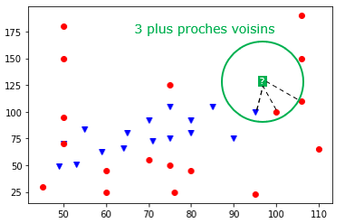
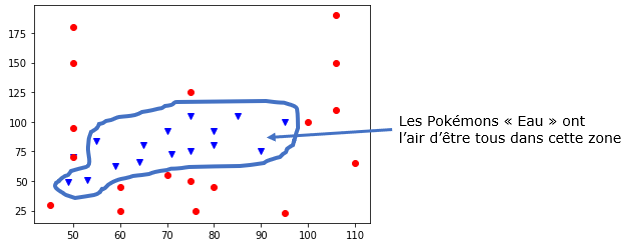
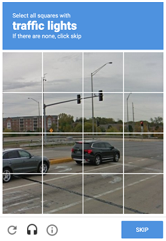

# Algorithme des k plus proches voisins

> Abrégé *kppv* en français. En anglais, on dit *k nearest neighbors* souvent abrégé *knn*.

L’algorithme des k plus proches voisins appartient à la famille des algorithmes d’*apprentissage automatique* (machine learning) qui constituent le poumon de l'intelligence artificielle actuellement.

Pour simplifier, l'apprentissage automatique part souvent de données (data) et essaye de dire quelque chose des données qui n'ont pas encore été vues : il s'agit de *généraliser*, de *prédire*. 

**Exemple d'introduction**

On dispose de données sur 34 Pokémons : leur type (Psy ou Eau), leur points de vie et la valeur de leurs attaques. On peut représenter ces données graphiquement, avec les points de vie en abscisses et les valeurs d'attaque en ordonnées.

Les Pokémons de type "Eau" sont représentés pas les points bleus, et ceux de type "Psy" par les points rouges.

> Peut-on prédire le type d'un nouveau Pokemon inconnu ?

Ce problème, qui demande à prédire à quelle catégorie, ou *classe*, appartient ce nouvel élément donné, est appelé *problème de classification*. L'algorithme des k plus proches voisins permet de trouver les k voisins les plus proches (si k = 5 on cherche les 5 voisins les plus proches) de ce nouvel élément dans le but de lui associer une *classe* plausible (Psy ou Eau, dans cet exemple).

## Algorithme naïf des kppv

A partir d'un jeu de données (par exemple, les données sur nos 34 Pokémons) et d'une donnée *cible* (le nouveau Pokemon à classifier), l'algorithme de $k$ plus proches voisins déterminer les $k$ données les plus proches de la cible.

Voici un algorithme permettant de résoudre ce problème :

**Données et préconditions :**
- une table `donnees` de taille `n` contenant les données et leurs classes
- une donnée cible : `cible`
- un nombre `k` inférieur à `n`
- une règle permettant de calculer la *distance* entre deux données

**Résultat :** un tableau contenant les `k` plus proches voisins de la donnée cible.

**Algorithme :**
1. Créer une table `distances_voisins` contenant les éléments de la table `donnees` et leurs distances avec la donnée `cible`.  
2. Trier les données de la table `distances_voisins` selon la distance croissante avec la donnée `cible`
3. Renvoyer les `k` premiers éléments de cette table triée.

### Et notre prédiction alors ?

L'algorithmes des kppv en lui-même n'apporte pas la réponse à notre problème de classification puisqu'il ne fournit que les k plus proches voisins (et leurs classes) de notre donnée cible. Il reste donc une dernière étape pour prédire la classe de notre nouvel élément : pour cela, on choisit la *classe majoritaire* (la plus présente) dans les k plus proches voisins.

> On est contents si k est impair car il ne peut pas y avoir d'ex-aequo !

### Influence de la valeur de $k$

La valeur de $k$ est très importante, elle doit être choisie judicieusement car elle a une influence forte sur la prédiction. Regardons le résultat de la prédiction pour différentes valeurs de $k$ sur notre exemple.

**Exemple 1** : le 1 plus proche voisin

Si $k = 1$, cela revient à chercher la donnée la plus proche de notre élément cible. Ici, on se rend compte que sa classe est "Eau" (point bleu) donc on classerait le nouveau Pokémon comme étant de type "Eau".

**Exemple 2** : les 3 plus proches voisins

On se rend compte que la classe majoritaire dans les 3 plus proches voisins est "Psy" (2 points rouges contre 1 point bleu) donc on classerait le Pokemon inconnu comme étant de type "Psy".

**Exemple 3** : les 9 plus proches voisins

On se rend compte que la classe majoritaire dans les 9 plus proches voisins est "Eau" (5 points bleus contre 4 points rouges) donc on classerait le Pokemon inconnu comme étant de type "Eau".

En poursuivant, si on choisit $k=34$ (le nombre total de données), alors la prédiction serait toujours "Psy" car c'est la classe majoritaire de l'échantillon. Il est donc incorrect de pense que plus la valeur de $k$ augmente meilleure sera la prédiction, c'est plus complexe que cela.

> C'est bien beau tout ça, mais quelle valeur de $k$ faut-il choisir ?

### Choix de la valeur de $k$ par expérimentation

Pour trouver une bonne valeur de $k$ il est possible d'appliquer le protocole expérimental suivant :

- Séparer les données en deux paquets : un paquet pour *entraîner le modèle* (90 % par exemple), un second pour *tester le modèle* (les 10% restants)
- Utiliser le premier paquet comme nouveau jeu de données et appliquer l'algorithme des kppv sur les éléments qui ont été retirés
- Comparer les réponses de l'algorithme avec les réponses attendues (on connaît la classe des éléments retirés donc on peut comparer)

En appliquant ce protocole à différentes valeurs de $k$, on peut déterminer quelle valeur fournit les meilleurs résultats. Il est même judicieux de recommencer en retirant d'autres données pour affiner encore davantage la recherche de la meilleure valeur $k$ : on parle alors de *validation croisée* qui est une méthode d'apprentissage.

##  Choix de la distance

L'algorithme des plus proches voisins repose presque entièrement sur la *distance* entre deux données. Dans les exemples vus précédemment, c'est la distance "naturelle" qui a été choisie (celle "à vol d'oiseau"). 

Dans un repère orthonormé, si $A$ et $B$ ont pour coordonnées respectives $(x_A, y_A)$ et $(x_B, y_B)$ alors la distance entre ces deux points est donnée par la formule :

$$\text{distance}(A, B) = \sqrt{(x_B-x_A)^2 + (y_B-y_A)^2}.$$ 

On parle alors de la *distance euclidienne*. Sachez cependant qu'il existe d'autres distances et vous en rencontrerez dans les exercices. Par exemple, on peut très bien imaginer que les valeurs sur l'axe des ordonnées ne nous intéressent pas et utiliser une distance ne prenant en compte que l'axe des abscisses avec la formule $\text{distance}(A, B) = |x_B-x_A|$. Ainsi, sur notre exemple, et avec cette distance, la classe majoritaire des 9 plus proches voisins de notre nouveau Pokémon est "Psy" (6 points rouges contre 3 points bleus), ce qui donnerait une prédiction contraire à celle donnée en utilisant la distance "naturelle" (euclidienne).

**Moralité :** On voit donc que le choix de la distance n'est pas anodin et que ce choix peut aboutir à des prédictions différentes.

> **Remarque** : Nous n'avons parlé ici que de distances *géométriques* qui ne s'appliquent qu'à des données chiffrées. Toutes les données ne sont pas adaptées à ce type de distance : si on veut comparer la distance entre deux chaînes de caractères (dans le but de prédire la langue d'origine de certains mots par exemple) d'autres types de distances sont à considérer : *la distance de Hamming* ou la *distance d'édition* qui seront abordées en Terminale.

## Un algorithme d'*apprentissage* ? d'*IA* ?

### Apprentissage par coeur

La plupart des algorithmes d'apprentissage automatique cherchent à *apprendre* quelque chose du jeu de données qui lui est fourni, c'est-à-dire à remplacer les données par un *modèle* (une sorte de "règle" permettant de classer les données, de prendre une décision, etc.). Autrement dit, un tel algorithme tente de "comprendre" les données pour en déduire un modèle, on peut voir cela comme un apprentissage *intelligent*.

Pour illustrer cela de manière simplifiée, un algorithme d'apprentissage automatique *intelligent* chercherait par exemple, à partir des données, à délimiter deux "zones" séparant les Pokémons "Psy" des Pokémons "Eau". Il n'aurait alors plus besoin des données (des points) pour prédire la classe d'un nouvel élément car il suffirait de regarder dans quelle zone celui-ci se trouve (d'utiliser le modèle qu'il a deviné).

L'algorithme des k plus proches voisins n'a pas cette "intelligence" car il n'essaie pas de construire un modèle mais se sert des données elles-mêmes pour donner un résultat : on parle alors d'**apprentissage par coeur**.

### Intelligence Artificielle

> L'algorithme des k plus proches voisins est-il alors un algorithme d'intelligence artificielle ?

L'apprentissage par coeur est clairement l'apprentissage le moins intelligent mais la réponse est OUI si on considère sa capacité de prédiction : classifier un élément qu'il n'a jamais vu.

## Les données et l'apprentissage automatique

### Big data et deep learning

Le **deep learning** (ou *apprentissage profond*) est une famille de méthode d'apprentissage automatique. En 2012, les techniques de deep learning ont réussi à fonctionner et obtenir des résultats spectaculaires. Ces résultats ont été rendus possibles notamment par l'arrivée de données en volume massifs (**big data**) permettant aux algorithmes d'apprendre à résoudre un problème. Ces données en masse permettent de disposer d'une importante quantité de données sur lesquelles entrainer et affiner les algorithmes.

Les stratégies mises en place par les géants du numérique (GAFAM) tournent entièrement autour de la récolte de données de leurs clients sur n'importe quel sujet pour "nourrir" leurs algorithmes d'apprentissage. C'est ainsi qu'Amazon arrive à nous proposer des "suggestions d'achat". Google quant à lui nous utilise lorsque nous devons prouver que nous ne sommes pas un robot. En effet, qui n'a pas déjà vu un écran de ce genre ?

En cliquant aux bons endroits, on assigne une classe aux différentes parties de l'image (feu de circulation ou non) et celles-ci viennent alimenter les bases de données sur lesquelles les algorithmes s'entraînent. Ils serviront ensuite aux voitures autonomes de Google à repérer les feux tricolores sur la route.

### Qualité des données et dangers

La qualité des données est primordiale dans l'apprentissage automatique car ce sont elles qui définissent presque entièrement la qualité des résultats des algorithmes. Voici quelques exemples, en vrac :

- Si la base de données utilisée pour entraîner un algorithme de détourage n'est constituée que de photos d'humains, il y a des fortes chances que l'algorithme ne parvienne pas à détourer un chat correctement. C'était le cas au départ pour l'algorithme du site [remove.bg](http://www.remove.bg) mais les données d'entraînement sont désormais plus complètes et les détourages fournissent des résultats impressionnants.
- L’algorithme mis en place à partir de 2015 par Amazon ([source](https://www.reuters.com/article/us-amazon-com-jobs-automation-insight/amazon-scraps-secret-ai-recruiting-tool-that-showed-bias-against-women-idUSKCN1MK08G#_blank)) pour faciliter le recrutement de talents utilisait des données de centaines de milliers de curriculum vitae (CV) reçus par Amazon au cours des dix dernières années en vue de noter de nouvelles candidatures. L’algorithme a été rapidement suspendu car il discriminait grandement les femmes. En effet, les CV d'entraînement comprenait une écrasante majorité d'hommes, l’algorithme ne laissant du coup aucune chance aux nouvelles candidates pourtant qualifiées. On dit dans ce cas que les données sont *biaisées*.
- Aux Etats-unis, ils prédisent les taux de criminalité dans les quartiers et déploient les effectifs policiers en conséquence. Mais les données sur lesquelles les systèmes sont entrainés sont également biaisés car déséquilibrés avec davantage de personnes de couleurs par exemple (voir [source](https://www.technologyreview.com/2019/02/13/137444/predictive-policing-algorithms-ai-crime-dirty-data/)).
- ...

> “*Your system is only as good as the data that you use to train it on*”, Kate Crawford, cofounder and co-director of AI Now

## Conclusion

- Nous avons vu que l'algorithme des $k$ plus proches voisins faisait partie de la famille des algorithmes d'apprentissage automatique (*machnine learning* en anglais) qui se nourissent de données pour prédire des choses sur une donnée inconnue. En particulier, il permet de résoudre des problèmes de classification.
- L'algorithme de kppv permet de trouver les $k$ voisins les plus proches d'une nouvelle donnée. Il est donc nécessaire de lui associer une distance pour apprécier cette notion de proximité.
- On peut alors prédire la classe d'une nouvelle donnée en prenant celle qui est majoritaire parmi ses plus proches voisins.
- Les prédictions varient selon la valeur de $k$ et selon la distance choisie : en pratique il est donc important de bien choisir ce deux données.
- Les algorithmes d'apprentissage automatique (IA) se sont beaucoup développés depuis les années 2010 grâce au *big data* qui leur permet de s'entraîner sur un très grand nombre de données.
- La qualité des résultats dépend grandement de la qualité des données d'entraînement : il est donc important de s'assurer de leur qualité pour éviter des *biais* pouvant être discriminants, racistes...

---

**Références :**
- Documents ressources du DIU EIL, Université de Nantes, C. JERMANN.
- Prepabac, spécialité NSI 1ère, C. ADOBET, G. CONNAN, G. ROZSAVOLGYI, L. SIGNAC (pour l'idée des données sur les Pokémons).
- Cours de David ROCHE : [ici](https://pixees.fr/informatiquelycee/n_site/nsi_prem_knn.html)

---
Germain BECKER, Lycée Mounier, ANGERS 
