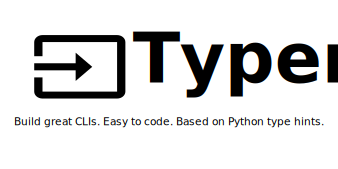

# Projet : Créer une interface en ligne de commande avec Python pour interroger une API


Une **interface en ligne de commande** (**CLI** en anglais pour *Command Line Interface*) est une interface homme-machine dans laquelle la communication entre l'utilisateur et l'ordinateur s'effectue en mode texte (au moyen du terminal dans notre cas).

L'objectif est de créer une telle application avec Python et plus précisément avec la bibliothèque [Typer](https://typer.tiangolo.com/) qui permet de créer rapidement de telles applications.


# Configuration

## Installation de Typer



Pour commencer, il faut installer la bibliothèque **Typer** avec la ligne de commande suivante dans un terminal :

```bash
pip install typer
```

> **Remarque** : au lycée, vous n'avez pas les droits pour faire cela, la bibliothèque sera installée par l'administrateur.

## Création des fichiers

**Q1** : Utilisez uniquement les lignes de commandes pour créer un répertoire vide `projet_cli_api`, et créer les 3 fichiers suivants (vides pour le moment) dans ce répertoire :

- `__init__.py` : pour faire de ce répertoire un module Python (ce fichier restera vide) ;
- `main.py` : le fichier qui contiendra le code de notre application en ligne de commande Typer ;
- `config.py` : pour stocker les données secrètes (notre clé d'API notamment).

**Q2** : Vérifiez que le répertoire et les fichiers ont bien été créés, toujours en utilisant les lignes de commande.

# Création d'une application

## Exemple (le plus) simple

**Q3** : Dans le fichier `main.py`, ajoutez le code suivant :

```python
import typer

def main(nom: str):
    typer.echo(f"Bonjour {nom}")

if __name__ == "__main__":
    typer.run(main)
```

**Analyse** : 
- On a défini une fonction `main()` qui prend une chaîne `nom` en paramètre et qui écrit une chaîne dans la console (grâce à la fonction `typer.echo()`).
- `if __name__ == "__main__":` permet de définir les instructions à exécuter (ici `typer.run(main)` pour exécuter la fonction `main()` définie au-dessus) lorsque le fichier est exécuté directement (et pas importé), comme nous allons le faire de suite.

**Q4** : Exécutez l'application en exécutant dans le terminal (en étant placé dans le répertoire `projet_api_cli`) la commande suivante :

```bash
$ python main.py
```

Vous devriez voir apparaître le message

```bash
Usage: main.py [OPTIONS] NOM
Try 'main.py --help' for help.

Error: Missing argument 'NOM'.
```

qui pointe une erreur indiquant que l'argument `'NOM'` est manquant. Il s'agit en effet de la chaîne `nom` qui doit être passée à la fonction `main()`.

**Q5** : Exécutez la commande proposée pour afficher l'aide. Vous devriez voir apparaître dans le terminal un message commençant par

```bash
Usage: main.py [OPTIONS] NOM

Arguments:
  NOM  [required]
```

qui indique qu'il faut exécuter la commande `main.py [OPTIONS] NOM` dans le terminal où l'argument `NOM` est obligatoire.

**Q6** : En tenant compte de cette aide, exécutez maintenant la bonne commande pour que l'application vous passe le bonjour.

## Un exemple avec deux commandes

**Q7** : Modifiez le fichier `main.py` comme suit :

```python
import typer
from datetime import datetime

app = typer.Typer()

@app.command()
def bonjour(nom: str):
    """ Commande 1 : affiche "Salut {nom}" dans le terminal """
    typer.echo(f"Salut {nom}")

@app.command()
def jour_de_la_semaine(date: datetime):
    """ Commande 2: affiche le jour de la semaine correspondant à la date 
    donnée (au format YYYY-MM-DD). """
    typer.echo(date.strftime('%A'))


if __name__ == "__main__":
    app()
```

**Analyse** : Le programme ci-dessus va

- créer de manière explicite une application Typer avec `typer.Typer` (précédemment, `typer.run` en créait une implicitement).
- ajouter deux commandes avec le décorateur `@app.command()` à notre application : concrètement on pourra alors indiquer dans notre ligne de commande celle que l'on veut exécuter (voir plus bas).
-  exécuter l'`app()` elle-même, comme s'il s'agissait d'une fonction (au lieu de `typer.run`).

**IMPORTANT** : On peut maintenant exécuter la commande que l'on souhaite de la façon suivante

```bash
$ python main.py <nom de la commande> <arguments>
```

**Q8** : Exécutez la ligne de commande `python main.py --help` pour trouver les noms des deux commandes de notre application. Quels sont-ils ?

> *Remarque* : Pour obtenir l'aide d'une commande précise il suffit d'exécuter l'instruction suivante (on voit notamment les arguments à passer à la commande).
>
```bash
$ python main.py <nom de la commande> --help
```

**Q9** : Écrivez et exécutez la ligne de commande permettant à l'application de vous dire bonjour.

**Q10** : Écrivez et exécutez la ligne de commande permettant de connaître le jour de la semaine correspondant à la date du jour. Et pour connaître le jour de la semaine de votre naissance ?


## Des arguments optionnels (facultatif, au moins dans un premier temps)

### Arguments par défaut

Il est possible de définir des arguments par défaut à nos commandes, cela revient à définir des arguments par défaut aux fonctions Python correspondantes.

**Exemple**

Pour le moment, il nécessaire de passer la date souhaité comme argument à notre commande `jour-de-la-semaine`. Pour afficher le jour correspondant au 16 janvier 2022, il faut écrire l'instruction :

```bash
$ python main.py jour-de-la-semaine 2022-01-16
```

On aimerait avoir le choix de ne pas préciser la date en argument, auquel cas c'est la date du jour qui serait choisie par défaut. C'est-à-dire que la ligne de commande

```bash
$ python main.py jour-de-la-semaine
```

affiche le jour actuel.

Pour cela, on peut modifier le fichier `main.py` de la façon suivante :

```python
import typer
from datetime import datetime

app = typer.Typer()

@app.command()
def bonjour(nom: str):
    """ Commande 1 : affiche "Salut {nom}" dans le terminal """
    typer.echo(f"Salut {nom}")

# Date par défaut
date_par_defaut = typer.Argument(datetime.now().strftime('%Y-%m-%d'))

@app.command()
def jour_de_la_semaine(date: datetime = date_par_defaut):
    """ Commande 2 : affiche le jour de la semaine correspondant à la date 
    donnée (au format YYYY-MM-DD). """
    typer.echo(date.strftime('%A'))


if __name__ == "__main__":
    app()
```

**Analyse** : On a ajouté une valeur par défaut (`date_par_defaut`) à notre paramètre `date` de la fonction `jour_de_la_semaine()`. Cette valeur est définie en utilisant `typer.Argument()` dont le premier paramètre est la valeur par défaut : ici `datetime.now().strftime('%Y-%m-%d')` soit la date du jour.

### Définir une option

Dans une ligne de commande, une **option** modifie le fonctionnement d'une commande. La syntaxe d'une ligne de commande est :

```bash
$ commande [options] arguments
```

où les options sont optionnelles et commencent (selon les conventions actuelles) par deux tirets `--` suivis du nom de l'option souhaité (comme `--help`).

**Exemple**

On aimerait ajouter une option `--` à notre commande `bonjour` qui permette de saluer quelqu'un de manière formelle si l'option est choisie. 

Pour cela, on peut modifier la fonction `bonjour` de la façon suivante :

```python
@app.command()
def bonjour(nom: str, formel: bool = False):
    if formel:
       typer.echo(f"Bien le bonjour {nom}")
    else:
        typer.echo(f"Salut {nom}")
```

**Analyse** : On a définit un paramètre booléen `formel` dont la valeur par défaut est `False`. Selon la valeur de ce paramètre, la commande affiche "Salut {nom}" ou "Bien le bonjour {nom}".

Essayez les deux lignes de commandes :

```bash
$ python main.py bonjour --formel Germain
```

et 

```bash
$ python main.py bonjour Germain
```

> Il est possible de définir des options autres que des booléens en utilisant `typer.Options()`, pour cela se référer à la documentation officielle : [https://typer.tiangolo.com/tutorial/options/](https://typer.tiangolo.com/tutorial/options/).


# À vous de jouer !

Vous devez écrire une application en ligne de commande pour interroger une ou plusieurs API.

**Contraintes** :

- L'application doit posséder au moins 3 commandes distinctes, chacune interrogeant au moins une API, et devant au moins posséder un argument par défaut et/ou au moins une option
    - la première commande est chargée d'afficher le nombres de places disponibles dans les parkings à Angers en utilisant l'API de [data/angers.fr](https://data.angers.fr/explore/dataset/parking-angers/information/)
    - la seconde commande est chargé d'afficher des informations sur la météo (température, etc.) dans une ville passée en paramètre en utilisant l'API *Current weather data* du site OpenWeather : [https://openweathermap.org/current](https://openweathermap.org/current) pour des données sur la météo en temps réel (l'accès à cette API est gratuit mais un compte doit être créé pour obtenir une clé d'API)
    - la troisième commande aura le rôle de votre choix et interrogera l'API de votre choix (vous en trouverez quelques-unes intéressantes ci-dessous)
- Si une API nécessite une clé d'identification, cette clé devra être renseignée dans le fichier `config.py` en tant que chaîne de caractères et sera importée dans le fichier `main.py` (en production, ce fichier ne serait pas visible pour garder ses informations secrètes).

*Quelques autres API intéressantes* :

- toutes les API de données ouvertes
- les API de la NASA : [https://api.nasa.gov/](https://api.nasa.gov/) 
- [https://quadratic-solver-api.herokuapp.com/](https://quadratic-solver-api.herokuapp.com/) pour résoudre une équation du second degré
- [https://agify.io/](https://agify.io/) pour prédire l'âge d'une personne selon son nom et son pays
- [https://www.themoviedb.org/documentation/api](https://www.themoviedb.org/documentation/api) pour des informations sur des films (création d'un compte nécessaire)
- [http://open-notify.org/](http://open-notify.org/) pour la localisation et les atronautes de l'ISS
- [https://genius.com/api-clients](https://genius.com/api-clients) (création d'un compte nécessaire)
- [https://isevenapi.xyz/](https://isevenapi.xyz/) 
- [https://pixabay.com/api/docs/](https://picsum.photos/) pour des photos (création d'un compte pixabay nécessaire)
- [https://picsum.photos/](https://picsum.photos/) pour des photos
- [https://docs.blague.xyz/](https://docs.blague.xyz/) pour des blagues (en français)
- [https://goqr.me/api/](https://goqr.me/api/) pour générer (et lire) des QR Codes
- [https://www.remove.bg/fr/api#remove-background](https://www.remove.bg/fr/api#remove-background) pour supprimer l'arrière-plan d'une photo (= détourage), création d'un compte gratuit pour 50 appels par mois
- vous en trouverez d'autres ici : [https://github.com/public-apis/public-apis](https://github.com/public-apis/public-apis)


---
**Références** : 
- Le documentation du la bibliothèque Python *Typer* : [https://typer.tiangolo.com/](https://typer.tiangolo.com/)
- Les articles de blog de *Bugbytes* : [https://bugbytes.io/posts/nasa-command-line-application-with-typer-and-python/](https://bugbytes.io/posts/nasa-command-line-application-with-typer-and-python/) et [https://www.bugbytes.io/posts/nasa-command-line-application-with-typer-and-python-fetching-images/](https://www.bugbytes.io/posts/nasa-command-line-application-with-typer-and-python-fetching-images/)
- Les deux vidéos associées : [https://youtu.be/rXAo8zaXQJY](https://youtu.be/rXAo8zaXQJY) et [https://youtu.be/aOEZ449Ufz8](https://youtu.be/aOEZ449Ufz8)

---

Germain BECKER, Lycée Mounier, ANGERS

Ressource éducative libre distribuée sous [Licence Creative Commons Attribution - Partage dans les Mêmes Conditions 4.0 International](http://creativecommons.org/licenses/by-sa/4.0/) 

