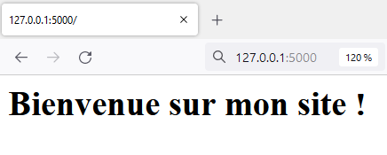
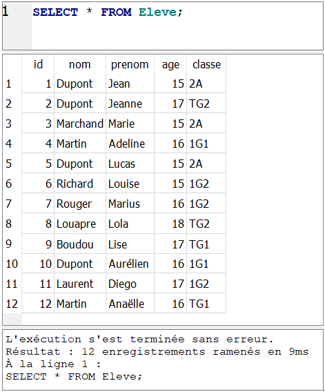
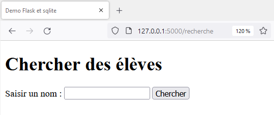
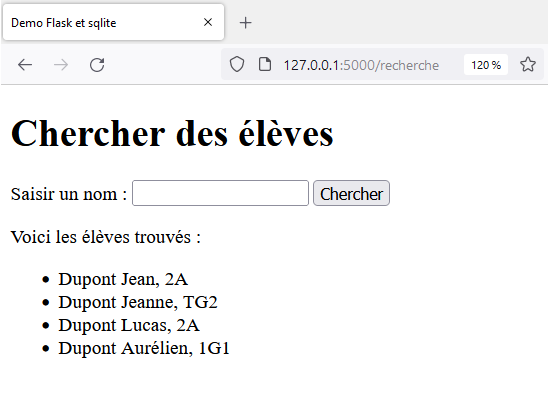
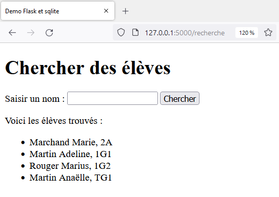

<h1>TP : Flask et sqlite
<hr>
<br>Partie 2 : Utiliser une base de données avec Flask</h1>


**Objectif** : créer une application Flask permettant de rechercher des élèves dans une base de données `eleves.db` et les afficher à l'écran.

>Pour réaliser ce TP, nous allons reprendre et adapter ce qui a été vu dans le TP [SQL avec Python](https://info-mounier.fr/terminale_nsi/base_de_donnees/sql_avec_python.php) et des TP de Première sur Flask : [Découverte du framework Flask](https://info-mounier.fr/premiere_nsi/web/activite_decouverte_flask.php) et [Traitement des données d'un formulaire avec Flask](https://info-mounier.fr/premiere_nsi/web/activite_traitement_formulaire.php). Il peut donc être utile de revoir cela si nécessaire.

Avant de démarrer, on se place dans le dossier `flask-sqlite` et on active l'environnement virtuel `venv` si ce n'est pas déjà fait :

Sous Linux :

```bash
$ . venv/bin/activate
```

ou 

```bash
$ source venv/bin/activate
```

De même, une fois l'environnement virtuel activé, Flask doit être installé si ce n'est pas déjà fait :

```bash
pip install flask
```

**Vous pouvez désormais commencer votre projet d'application Flask !**

# Application minimale

Dans le répertoire `flask-sqlite`, on crée un fichier `main.py` dans lequel on crée notre application Flask minimale :

```python
from flask import Flask

app = Flask(__name__)

@app.route("/")
def index():
    return "<h1>Bienvenue sur mon site !</h1>"
```

Après avoir sauvegardé ce fichier `main.py`, on peut exécuter notre application. Pour cela on peut utiliser la commande `flask` :

```bash
$ flask --app main run
 * Serving Flask app 'main'
 * Debug mode: off
WARNING: This is a development server. Do not use it in a production deployment. Use a production WSGI server instead.
 * Running on http://127.0.0.1:5000
Press CTRL+C to quit
```

Si vous accédez à l'URL http://127.0.0.1:5000 dans un navigateur vous devriez voir le message de bienvenue. Pour arrêter le serveur il suffit de presser CTRL+C dans le terminal.



## Mode debug

La commande `flask run` peut aussi activer le mode de débogage, qui permet de redémarrer automatiquement le serveur lorsqu'une modification de code est effectuée et affiche directement dans le navigateur les erreurs qui pourraient avoir lieu lors d'une requête.

<blockquote class="attention">
    <p>Attention à ne surtout pas activer le mode de débogage ni le serveur de développement dans un environnement de production, cela entraînerait un risque majeur de sécurité.</p>   
</blockquote>

Pour lancer l'application avec le mode `debug` activé, on exécute la commande :

```bash
$ flask --app demo --debug run
 * Serving Flask app 'main'
 * Debug mode: on
WARNING: This is a development server. Do not use it in a production deployment. Use a production WSGI server instead.
 * Running on http://127.0.0.1:5000
Press CTRL+C to quit
 * Restarting with stat
 * Debugger is active!
 * Debugger PIN: nnn-nnn-nnn
```

<blockquote class="info">
    
Il est aussi possible de démarrer (en mode debogage) notre application en terminant le fichier `main.py` par les lignes

```python
if __name__ == '__main__':
    app.run(debug=True)
```

puis en exécutant le fichier `main.py` :

```bash
$ python main.py
```

</blockquote>


# La base de données utilisée

L'application que l'on souhaite écrire, permet d'interagir avec la base de données `eleves.db` qui a été créée dans le TP [SQL avec Python](https://info-mounier.fr/terminale_nsi/base_de_donnees/sql_avec_python.php) et que vous pouvez télécharger en cliquant sur le lien suivant : <a href="data/eleves.db" download>eleves.db</a>.

<span class="emoji">👉</span> Placez le fichier `eleves.db` dans le répertoire `falsk-sqlite`. À ce stade, l'arborescence du projet est la suivante :

```
/flask-sqlite
    /venv
    eleves.db
    main.py
```

Cette base de données ne contient qu'une seule table appelée `Eleve` dont le contenu est le suivant :




# Une page pour rechercher des élèves

On veut créer une route `/recherche` qui permet à l'utilisateur de saisir le nom d'un élève dans un champ de formulaire et qui permet de chercher dans la base de données et renvoyer tous les élèves dont le nom correspond à celui saisi.

Cette route sera chargée :
- d'afficher uniquement le formulaire si on accède à l'URL `/recherche` avec la méthode GET
- d'afficher en plus la liste des élèves correspondant à la recherche si on fait une requête POST à l'URL `/recherche` en validant le formulaire

```python
from flask import Flask, render_template  # on importe render_template !!!

# reste du code

@app.route("/recherche")
def recherche():
    return render_template("recherche.html")
```

> Le template `recherche.html` qui sera utilisé pour construire la page n'est pas encore écrit, c'est ce que nous allons faire tout de suite !

## Création du formulaire

On crée un dossier `templates` dans le répertoire du projet et à l'intérieur de ce dossier on crée le template `recherche.html` :

```
/flask-sqlite
    /templates
        recherche.html
    /venv
    eleves.db
    main.py
```

Voici le contenu de ce template :

**/templates/recherche.html**

```html
<!DOCTYPE html>
<html lang="fr">
<head>
    <meta charset="UTF-8">
    <meta http-equiv="X-UA-Compatible" content="IE=edge">
    <meta name="viewport" content="width=device-width, initial-scale=1.0">
    <title>Demo Flask et sqlite</title>
</head>
<body>
    <form action="" method="POST">
        <h1>Chercher des élèves</h1>
        <p>
            <label for="nom">Saisir un nom : </label>
            <input type="text" name="nom" id="nom" required>
            <input type="submit" value="Chercher">
        </p>
    </form>
</body>
</html>
```

**Remarques** :
- la valeur de l'attribut `action` est vide pour envoyer le formulaire à la route `/recherche` elle-même avec la méthode POST
- l'attribut `name` a pour valeur `nom`, cela sera utile par la suite pour récupérer la valeur saisie par l'utilisateur

En lançant le serveur avec la commande `$ flask --app demo --debug run` et en naviguant à l'URL `http://127.0.0.1:5000/recherche` vous devriez voir la page suivante :



> Il reste encore le gros du travail à faire : récupérer la valeur saisie par l'utilisateur dans ce formulaire, chercher dans la base de données si des élèves correspondent, les récupérer le cas échéant pour les afficher sur la page. C'est parti !

## Récupérer et traiter le formulaire

### Interroger la base de données

Pour mieux organiser notre projet, on va créer un fichier `bdd.py` dans le répetoire du projet, et dans lequel on utilisera le module `sqlite3` pour interagir avec notre base de données `eleves.db`.

*Arborescence*

```
/flask-sqlite
    /templates
        recherche.html
    /venv
    bdd.py
    eleves.db
    main.py
```

On sait que l'on va devoir interroger la base de données pour savoir si des élèves portent le nom saisi par l'utilisateur. On crée donc dans ce fichier une fonction prenant en paramètre une chaîne de caractères `nom` et qui renvoie la liste de tous les élèves portant ce nom (cette fonction a déjà été écrite dans le TP [SQL avec Python](https://info-mounier.fr/terminale_nsi/base_de_donnees/sql_avec_python.php)). Voici le contenu du fichier :

**`bdd.py`**
```python
import sqlite3

def recuperer_eleves_par_nom(nom):
    conn = sqlite3.connect('eleves.db')
    cur = conn.cursor()
    res = cur.execute("SELECT nom, prenom, classe FROM Eleve WHERE nom = ?", (nom, ))
    eleves = res.fetchall()  # on stocke les résultats pour pouvoir les renvoyer
    conn.close()  
    return eleves  # après avoir fermé la connexion
```

> Vous remarquerez que cette fonction renvoie une liste de *tuples* de la forme (nom, prenom, classe). Cela sera utile par la suite pour afficher le nom, le prénom et la classe des élèves.

Par exemple,

```python
>>> recuperer_eleves_par_nom('Martin')
[(4, 'Martin', 'Adeline', '1G1'), (12, 'Martin', 'Anaëlle', 'TG1')]
```

On va pouvoir utiliser cette fonction dans notre fonction `recherche` chargée de traiter le formulaire.

### Traiter le formulaire

Il faut récupérer la valeur saisie par l'utilisateur. Cette valeur est transmise au serveur par le moyen d'une requête POST à la route `/recherche`. Pour traiter la requête on va utiliser la fonction `recuperer_eleves_par_nom` écrite précédemment, il faudra donc importer cette fonction dans le fichier `main.py`.

Voici une façon de faire :

**`main.py`**

```python
from flask import Flask, render_template, request  # on importe request !!!

from bdd import recuperer_eleves_par_nom  # on importe la fonction précédente

# reste du code

@app.route("/recherche", methods=['GET', 'POST'])
def recherche():
    if request.method == "POST":
        # si formulaire envoyé
        donnees = request.form
        nom = donnees.get('nom')
        liste_eleves = recuperer_eleves_par_nom(nom)
    else:
        # méthode GET
        liste_eleves = None
    return render_template("recherche.html", eleves=liste_eleves)
```

**Analyse** : On a ajouté `methods=['GET', 'POST']` au décorateur `@app.route` afin que notre route accepte à la fois les méthodes GET et POST.
- Si la méthode de la requête est POST, on sait que c'est le formulaire qui est envoyé. On peut récupérer les données de ce formulaire grâce au dictionnaire `request.form` puis récupérer la valeur saisie par l'utilisateur grâce à la clé `'nom'` (qui était la valeur de l'attribut `name` du champ de saisie du formulaire). On passe cette valeur à notre fonction `recuperer_eleves_par_nom` qui renvoie la liste d'élèves correspondante.
- Si la méthode de la requête est GET, c'est qu'on veut afficher la page avec le formulaire, dans ce cas la liste d'élèves n'existe pas puisque l'on a n'a pas encore fait de recherche.
- La fonction `recherche` renvoie ensuite le template `recherche.html`, auquel on passe la liste d'élèves dans une variable `eleves`.

### Adapter le template

Il reste à compléter le template `recherche.html` pour afficher la liste des élèves cherchés si le formulaire a été envoyé au serveur.

Ce n'est pas très compliqué, dans tous les cas (requête GET ou POST) on affiche le formulaire, et si la liste `eleves` n'est pas égale à `None` cela veut dire qu'une recherche a été effectuée. Dans ce cas, il y a deux possibilités : soit `eleves` est une liste vide et donc aucun élève n'a été trouvé, soit elle n'est pas vide et on affiche au moyen d'une boucle `for` les élèves trouvés (ici sous forme d'une liste non ordonnée grâce aux balises `<ul>` et `<li>`).

**/templates/recherche.html (uniquement le \<body\>)**

```html
<body>
    <!-- formulaire déjà écrit -->
    <form action="" method="POST">  
        <h1>Chercher des élèves</h1>
        <p>
            <label for="nom">Saisir un nom : </label>
            <input type="text" name="nom" id="nom" required>
            <input type="submit" value="Chercher">
        </p>
    </form>

    <!-- AJOUT -->
    
        
            <p>Aucun élève ne correspond à la recherche.</p>
        
            <p>Voici les élèves trouvés :</p>
            <ul>
                
                    <li>{{ eleve[0] }} {{ eleve[1] }}, {{eleve[2]}}</li>
                
            </ul>
        
    
    
</body>
```

**Remarques :**
    
- La syntaxe Jinja est utilisée dans le template. En particulier, `none` s'écrit avec une minuscule et la longueur d'une liste s'obtient grâce au filtre `nom_de_la_liste|length`. Pour en savoir plus sur une syntaxe particulière, rendez-vous sur la documentation officielle dont le lien est donné dans les références à la fin. 
- Chaque élève de la liste `eleves` parcouru dans la boucle `for` est un tuple de la forme (nom, prenom, classe) donc `{{ eleve[0] }} {{ eleve[1] }}, {{eleve[2]}}` permet d'écrire pour chaque élève le texte `nom prenom, classe`.

En enregistrant tous les fichiers et en saisissant le nom `Dupont` dans le formulaire, vous devez obtenir la page suivante après avoir validé la saisie :



## Amélioration

On se rend vite compte que la saisie doit être exacte. En effet, si on écrit `dupont` (en minuscules) dans le champ de saisie alors aucun élève n'est trouvé. De même, le nom doit être écrit en entier pour être trouvé, et on ne peut pas saisir de prénom. 

Pour que la recherche ne soit plus sensible à la casse, que l'écriture d'un nom puisse être partielle, que la recherche se fasse aussi dans les prénoms, on pourrait modifier la requête dans la fonction `recuperer_eleves_par_nom` de la façon suivante :

**`bdd.py`**
```python
def recuperer_eleves(saisie):
    conn = sqlite3.connect('eleves.db')
    cur = conn.cursor()
    res = cur.execute("""
        SELECT nom, prenom, classe 
        FROM Eleve 
        WHERE nom LIKE ? OR prenom LIKE ?
        """, 
        ('%' + saisie + '%', '%' + saisie + '%')
    )
    eleves = res.fetchall()  # on stocke les résultats pour pouvoir les renvoyer
    conn.close()  
    return eleves  # après avoir fermé la connexion
```

Ainsi, si l'utilisateur saisit `mar` dans le champ de saisie, alors la requête devient

```sql
SELECT nom, prenom, classe 
FROM Eleve 
WHERE nom LIKE '%mar%' OR prenom LIKE '%mar%'
```

On cherche donc si la chaîne `'mar'` apparaît dans la colonne `nom` ou dans la colonne `prenom`, et comme l'opérateur `LIKE` est insensible à la casse, on obtient le résultat suivant :



---

# ✍️ À vous de jouer !

## 💻 Exercice 1 : Créer une page pour faire une recherche par classe

🐍  **Q1** : Écrire un template `recherche-par-classe.html` (dans le répertoire `templates`) qui possède un formulaire permettant de saisir une classe et qui affiche en-dessous la liste des élèves correspondant lorsque le formulaire est validé. *Il suffit de modifier légèrement le template `recherche.html`*

🐍  **Q2** : Dans le fichier `bdd.py`, écrire une fonction `recuperer_eleves_par_classe` qui prend un paramètre une chaîne de caractères `classe` et qui renvoie la liste de tous les élèves de la table `Eleve` qui sont dans la classe `classe`. *Il suffit d'adapter la fonction `recuperer_eleves_par_nom`.*

*Exemple* :

```python
>>> recuperer_eleves_par_classe('1G1')
[(4, 'Martin', 'Adeline', 16, '1G1'), (10, 'Dupont', 'Aurélien', 16, '1G1')]
```

🐍  **Q3** : Dans le fichier `main.py` créer une fonction `recherche_par_classe` associée à la route `/recherche-par-classe` et qui permet de chercher tous les élèves correspondant à la classe saisie par l'utilisateur et d'afficher le template `recherche-par-classe.html` avec le formulaire et la liste d'élèves éventuelle. *Il suffit d'adapter légèrement la fonction `recherche` associée à la route `/recherche`.*

🐍  **Q4** : Faire en sorte que les élèves d'une classe s'affichent par ordre alphabétique.


## 💻 Exercice 2 : Afficher tous les élèves

🐍 Modifier la recherche par nom étudiée dans ce TP pour que dans le cas d'une requête GET vers la route `/recherche` s'affiche la liste de *tous* les élèves sous le formulaire. Plus concrètement, on souhaite que tous les élèves soient affichés par défaut, et seulement ceux correspondant à la recherche lorsque le formulaire est validé.


## 💻 Exercice 3 : Créer une page pour enregistrer un nouvel élève en base de données

🐍 En s'inspirant de ce qui a été fait précédemment, créer une route `/nouvel-eleve` permettant d'enregistrer dans la base de données `eleves.db` un nouvel élève (on rappelle que l'attribut `id` est auto-incrémenté et qu'il n'est pas nécessaire de le fournir).

> Vous pourrez vérifiez en vous rendant à la route `/recherche` créée à l'exercice précédent (ou en utilisant par exemple DB Browser for SQLite).


---
**Références**
- Le "Quickstart" de la documentation officielle de Flask  : [https://flask.palletsprojects.com/en/2.2.x/quickstart/](https://flask.palletsprojects.com/en/2.2.x/quickstart/) 
- Documentation officielle de Jinja : [https://jinja.palletsprojects.com/en/3.1.x/](https://jinja.palletsprojects.com/en/3.1.x/).