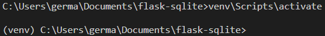
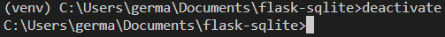
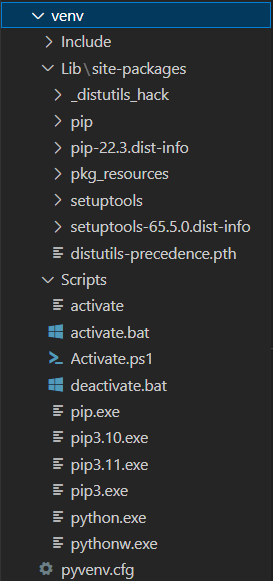

<h1>
    TP : Flask et sqlite
    <hr>
    Partie 1 : Utiliser un environnement virtuel et installer les paquets
</h1>


<p class="legende">Crédit : <a href="https://pixabay.com/fr/illustrations/gestion-de-projet-7446581/">geralt</a>, via Pixabay</p>

On profite de ce TP pour introduire, dans une première partie, quelques bonnes pratiques du développeur dans la conception d'un projet 
:
1. Création du dossier projet
2. Création d'un environnement virtuel
3. Installation des paquets

# Créer un dossier pour le projet

On va créer un répertoire `flask-sqlite` et se déplacer dans le dossier créé :

- sous Linux ou macOS :

```bash
$ mkdir flask-sqlite
$ cd flask-sqlite
```

- sous Windows :

```bash
> mkdir flask-sqlite
> cd flask-sqlite
```

>Il ne faut pas écrire les symboles `$` et `>` qui sont déjà écrits dans les terminaux respectifs Linux-macOS/Windows et qui indiquent le début d'une commande.

# Créer un environnement virtuel

Lorsque l'on installe des modules Python sur notre machine, ils sont tous localement stockés dans un même emplacement de votre disque dur, et dans cet emplacement on ne peut installer qu'une seule version de chaque module. 

Or, un développeur est souvent amené à travailler sur plusieurs projets simultanément, qui utilisent des versions de Python différentes et des modules dans des versions différentes également.

Ainsi, pour pouvoir organiser différents projets, il est important de créer un **environnement virtuel** pour chaque projet : cet environnement virtuel permet d'isoler sur votre machine la version de Python utilisée pour le projet ainsi que les différents modules (et leurs versions) nécessaires au projet.

En Python, on peut utiliser le module `venv` (pour **v**irtual **env**ironment) présent dans la distribution standard (voir la documentation officielle si nécessaire : [https://docs.python.org/fr/3/library/venv.html](https://docs.python.org/fr/3/library/venv.html))

Pour créer un environnement, la commande diffère selon le système d'exploitation. Il faut s'assurer d'**être placé dans le dossier projet** (ici `flask-sqlite`) puis exécuter la commande suivante dans le terminal :

- Sous Linux et macOS :

```bash
$ python -m venv venv
```

- Sous Windows :

```bash
> python -m venv venv
```

**Analyse** : Avec cette commande on utilise le module `venv` (le premier écrit) pour créer un environnement virtuel appelé `venv` (le second écrit, vous pouvez choisir un autre nom si vous souhaitez) dans le dossier `flask-sqlite`. On obtient alors l'arborescence

```
/flask-sqlite
    /venv
```

# Activer l'environnement virtuel

Enfin, avant de commencer à travailler, il faut activer cet environnement virtuel en exécutant la commande suivante :

- Sous Linux et macOS :

```bash
$ . venv/bin/activate
```

ou 

```bash
$ source venv/bin/activate
```

- Sous Windows :

```bash
> venv\Scripts\activate
```

Si tout s'est passé correctement vous devriez voir apparaître le nom de l'environnement virtuel (ici `(venv)` en début de ligne.


<p class="legende">Activation d'un environnement virtuel sous Windows</p>

<blockquote class="info">
    <p>Il faudra toujours activer l'environnement virtuel au départ avant de commencer à travailler dans le dossier du projet. Cela permettra notamment de pouvoir installer et utiliser les différentes versions des modules souhaités de manière isolée et propre à notre projet.</p>   
</blockquote>

**Remarque** : pour désactiver un environnement virtuel préalablement activé, il suffit d'exécuter la commande `deactivate`. Après la désactivation, le nom de l'environnement virtuel doit disparaître en début de ligne.


<p class="legende">Désactivation de l'environnement virtuel sous Windows</p>

# Contenu d'un environement virtuel

Un environement virtuel contient des répertoires et des fichiers. Le répertoire `Scripts` (sous Windows) ou `bin` (sous Linux) contient l'interpréteur Python, les exécutables pouvant être utilisés (comme `pip` par exemple) mais aussi tous les fichiers permettant d'activer ou de désactiver l'environnement virtuel. Le répertoire `Lib` (sous Windows) ou `lib` (sous Linux) contient quant à lui tous les  les scripts pour activer/désactiver l'environnement virtuel ainsi que les différentes commandes exécutables (dans le dossier `Scripts` sous Windows et `bin` sous Linus) mais aussi tous les modules installés dans l'environnement virtuel.


<p class="legende">Arborescence de l'environnement virtuel</p>

# Installation des modules

Une fois l'environnement virtuel activé, on peut installer les modules nécessaires à notre projet (on peut les installer au fur et à mesure de l'avancée du projet et des besoins). Par exemple, si on veut créer une projet Flask, on installe Flask avec la commande `pip` :

```bash
$ pip install flask
```

Flask ainsi que toutes ses dépendances (Werkzeug, Jinja, MarkupSafe, ItsDangerous et Click) s'installent dans l'environnement virtuel comme vous pouvez le voir dans le dossier `/flask-sqlite/venv/Lib`.

## Lister les modules installés

On peut utiliser la commande `pip freeze` pour lister les modules de notre projet :

```bash
$ pip freeze
click==8.1.3
colorama==0.4.6
Flask==2.2.2
itsdangerous==2.1.2
Jinja2==3.1.2
MarkupSafe==2.1.1
Werkzeug==2.2.2
```

Une utilisation importante de cette commande est de générer un fichier texte `requirements.txt` qui contient la liste des modules utilisés dans notre projet. On peut le faire avec la commande

```bash
$ pip freeze > requirements.txt
```

qui crée dans notre dossier projet, un fichier `requirements.txt` contenant dans la liste des modules précédente :

```
/flask-sqlite
    /venv
    requirements.txt
```

<blockquote class="info">
    <p>Si vous installez des modules au fur et à mesure, il ne faut pas oublier d'exécuter à nouveau cette commande pour mettre à jour le fichier <code>requirements.txt</code>.</p>   
</blockquote>

Dans le cas d'un projet collaboratif et/ou open source, ce fichier permet permet aux autres développeurs de facilement créer un environnement virtuel similaire au vôtre en installant les mêmes modules dans les mêmes versions que vous. Cela peut se faire avec la commande :

```bash
$ pip install -r requirements.txt
```

**Vous êtes désormais prêts à démarrer votre projet ! 😃**

---
**Références** :
- Documentation officielle du module `venv` : [https://docs.python.org/fr/3/library/venv.html](https://docs.python.org/fr/3/library/venv.html)
- Documentation officielle pour l'installation de Flask : [https://flask.palletsprojects.com/en/2.2.x/installation/](https://flask.palletsprojects.com/en/2.2.x/installation/) 
- Article de Docstring sur les environnements virtuels : [À quoi sert un environnement virtuel en Python ?](https://www.docstring.fr/glossaire/environnement-virtuel/)
- Pour en savoir plus sur les environnements virtuels, vous pouvez suivre la petite formation en 5 vidéos (11 minutes en tout) proposée par Docstring : [https://www.docstring.fr/formations/les-environnements-virtuels/pourquoi-utiliser-un-environnement-virtuel-222/](https://www.docstring.fr/formations/les-environnements-virtuels/pourquoi-utiliser-un-environnement-virtuel-222/)