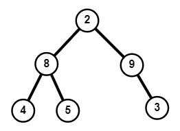
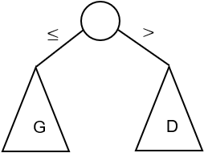
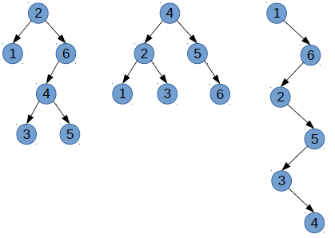
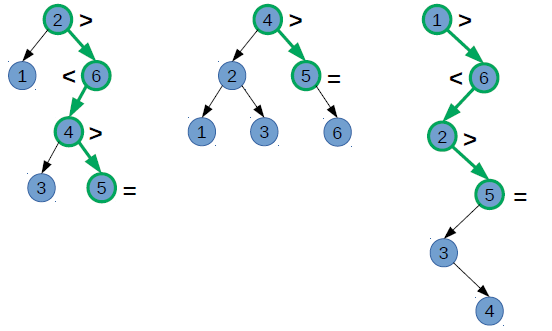
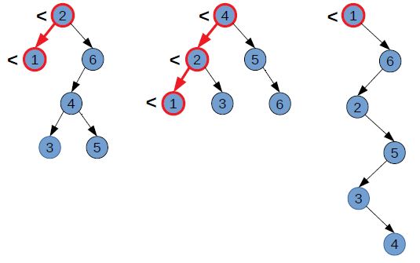
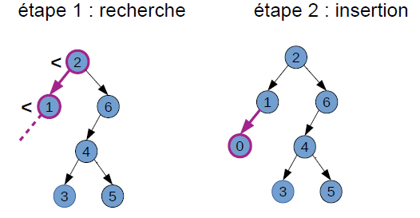
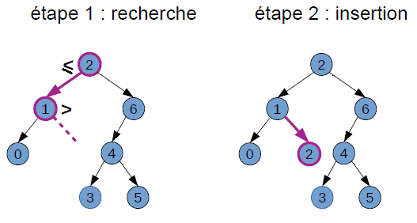
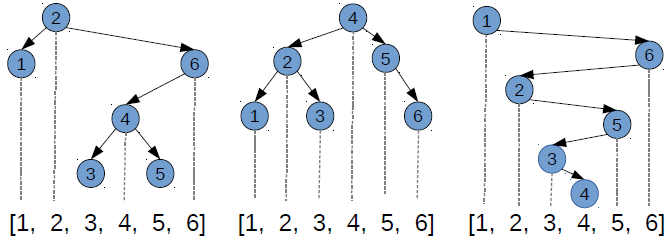

# Introduction

Un arbre binaire (abrégé AB dans la suite) est un arbre dont les noeuds possèdent au plus deux fils. Ainsi, un arbre binaire non vide peut être définit comme un noeud, appelé *racine* possédant un *sous-arbre gauche* et un *sous-arbre droit* (éventuellement vides) qui sont eux-mêmes des arbres binaires. 

Cette définition étant récursive, la plupart des traitements sur les AB sont naturellement récursifs : on traite un noeud courant et on demande à traiter les noeuds fils. On a déjà écrit de tels algorithmes pour calculer la taille ou la hauteur d'un AB (voir [Thème 1 / Chapitre 4 : Les arbres](http://info-mounier.fr/terminale_nsi/structures_donnees/arbres.php#Impl%C3%A9mentation)). On ne s'était alors pas soucié de l'ordre dans lequel tous les noeuds étaient visités.

Dans ce chapitre, nous allons notamment voir des algorithmes permettant d'explorer, récursivement ou non, tous les noeuds d'un AB mais dans un ordre prédéfini. Nous verrons dans un second temps une structure de données appelée **arbre binaire de recherche**, qui est un AB particulier permettant de stocker des éléments de façon à rendre leur recherche très efficace par la suite.

Dans la suite, pour écrire les algorithmes dans le langage Python, on utilisera la classe `Noeud` ci-dessous pour implémenter nos arbres binaires. On utilisera également la classe `File` suivante pour implémenter une file qui sera utile dans le parcours en largeur d'un arbre binaire.


```python
class Noeud:
    """Pour manipuler des arbres binaires"""
    def __init__(self, e, g=None, d=None):
        self.etiquette = e
        self.gauche = g
        self.droit = d

    def est_feuille(self):
        return not self.gauche and not self.droit
    
    # Une représentation possible de l'arbre
    def __repr__(self):
        ch = str(self.etiquette)
        if self.gauche or self.droit:
            ch = ch + '-(' + str(self.gauche) + ',' + str(self.droit) + ')'
        return ch

class File:
    """Pour manipuler des files"""
    def __init__(self):
        self.contenu = []
        
    def enfiler(self, element):
        self.contenu.append(element)
        
    def defiler(self):
        return self.contenu.pop(0)
       
    def taille(self):
        return len(self.contenu)
    
    def __repr__(self):
        ch = ""
        for e in self.contenu:
            ch = ch + str(e) + ","
        ch = ch[:-1] # pour enlever la dernière virgule
        ch = "<" + ch + "<"
        return ch
```

# Parcours d'un arbre binaire

Parcourir un arbre, c'est visiter tous ses noeuds, afin de pouvoir opérer une action tour à tour sur eux. Un *parcours d'arbre* définit dans quel ordre les noeuds sont visités.

## Parcours en largeur d'abord

<div class="important">
    <p>Dans le cas où un arbre est parcouru niveau par niveau (en commençant par la racine est en lisant de gauche à droite) on parle d'un <strong>parcours en largeur d'abord</strong>. On utilise le terme <em>largeur</em> car dans ce cas on explore les noeuds en balayant en largeur chaque niveau de l'arbre.</p>
</div>    

### Exemple



Dans le cas d'un parcours de cet AB en largeur d'abord, les noeuds sont visités dans l'ordre : 2 - 8 - 9 - 4 - 5 - 3.

> Un parcours en largeur d'abord n'est pas récursif.

### Algorithme de parcours en largeur

<div class="important">
    <p>L'utilisation d'une <strong>file</strong> permet d'écrire facilement l'algorithme de parcours en largeur d'abord. Le principe est le suivant :</p>
    <ul>
        <li>On enfile l'arbre de départ</li>
        <li>Tant que la file n'est pas vide :</li>
        <ul>
            <li>on défile un élément</li>
            <li>si celui-ci n'est pas un arbre vide :</li>
            <ul>
                <li>on affiche son étiquette</li>
                <li>on enfile ses fils gauche et droit (dont les racines sont les noeuds du niveau suivant)</li>
            </ul>
        </ul>
    </ul>
</div>

On utilise ainsi la file pour y insérer et donc traiter (en défilant) tour à tour les noeuds, niveau par niveau.

Voici une implémentation qui utilise une classe `File` pour représenter une file et la classe `Noeud` (cf. [Thème 1 / Chapitre 4 : Les arbres](http://info-mounier.fr/terminale_nsi/structures_donnees/arbres.php#Impl%C3%A9mentation)) pour représenter un AB :


```python
def parcours_en_largeur(A):
    """Affiche les étiquettes de l'arbre binaire A selon un parcours en largeur."""
    F = File()
    F.enfiler(A)
    while F.taille() != 0:
        a = F.defiler()  # renvoie le sommet
        if a is not None:
            print(a.etiquette)
            F.enfiler(a.gauche)
            F.enfiler(a.droit)
```

On peut vérifier en appliquant cette fonction à l'arbre de l'exemple précédent :


```python
A1 = Noeud(2, Noeud(8, Noeud(4), Noeud(5)), Noeud(9, None, Noeud(3)))
A1
```


    2-(8-(4,5),9-(None,3))


```python
parcours_en_largeur(A1)
```

    2
    8
    9
    4
    5
    3
    

## Parcours en profondeur

<div class="important">
    <p>Dans le cas où on explore complètement l'un des deux sous-arbres avant le second on parle d'un <strong>parcours en profondeur</strong>. On utilise le terme <em>profondeur</em> car dans ce cas on tente toujours de visiter le noeud le plus éloigné de la racine à condition qu'il soit le fils d'un noeud déjà visité.</p>
    <p>On distingue trois ordres particuliers pour explorer en profondeur les sous-arbres gauche, droit et la racine du noeud courant :</p>
    <ul>
        <li><strong>ordre préfixe</strong> : le noeud courant est traité, puis son sous-arbre gauche et son sous-arbre droit.</li>
        <li><strong>ordre infixe</strong> : le noeud courant est traité entre son sous-arbre gauche et son sous-arbre droit.</li>
        <li><strong>ordre suffixe</strong> : le noeud courant est traité après son sous-arbre gauche et son sous-arbre droit.</li>
    </ul>
</div>    

### Exemple


Voici l'ordre des noeuds visités dans les 3 ordres de parcours en profondeur :

- Parcours préfixe : 2 - 8 - 4 - 5 - 9 - 3
- Parcours infixe : 4 - 8 - 5 - 2 - 9 - 3
- Parcours suffixe : 4 - 5 - 8 - 3 - 9 - 2

### Algorithmes de parcours en profondeur

<div class="important">
    <p>Les algorithmes de parcours en profondeur s'écrivent facilement de manière récursive. Pour l'algorithme de parcours suivant l'ordre <strong>préfixe</strong> on procède ainsi :</p>
    <ul>
        <li>si l'arbre n'est pas vide :</li>
        <ul>
            <li>on affiche l'étiquette de sa racine</li>
            <li>on parcourt récursivement son sous-arbre gauche</li>
            <li>puis son sous-arbre droit</li>
            <li>(sinon on ne fait rien)</li>
        </ul>
    </ul>
</div>

Voici une fonction récursive qui implémente le parcours préfixe :


```python
def parcours_prefixe(A):
    """Affiche les étiquettes de l'arbre binaire A selon un parcours par ordre préfixe."""
    if A is not None:
        print(A.etiquette)
        parcours_prefixe(A.gauche)
        parcours_prefixe(A.droit)
```


```python
parcours_prefixe(A1)
```

    2
    8
    4
    5
    9
    3
    

>**Remarque** : Il suffit de changer l'ordre des lignes 4, 5 et  dans le `if` pour retrouver les ordres *infixe* et *suffixe* de parcours des noeuds.


```python
def parcours_infixe(A):
    """Affiche les étiquettes de l'arbre binaire A selon un parcours par ordre infixe."""
    if A is not None:
        parcours_prefixe(A.gauche)
        print(A.etiquette)
        parcours_prefixe(A.droit)
        
def parcours_suffixe(A):
    """Affiche les étiquettes de l'arbre binaire A selon un parcours par ordre suffixe."""
    if A is not None:
        parcours_prefixe(A.gauche)
        parcours_prefixe(A.droit)
        print(A.etiquette)
```


```python
parcours_infixe(A1)
```

    8
    4
    5
    2
    9
    3
    


```python
parcours_suffixe(A1)
```

    8
    4
    5
    9
    3
    2
    

## Recherche dans un AB

Pour vérifier sur une étiquette `e` est présente dans un noeud d'un arbre binaire `A`, il faut le parcourir (en largeur ou en profondeur). Dans le pire cas, c'est-à-dire si l'étiquette est absente, il faut bien regarder tous les noeuds pour conclure. Ainsi, pour un arbre binaire de $N$ noeuds, l'algorithme de recherche a un coût en temps de l'ordre de $N$ (noté $O(N)$).

>**Morale** : 
>- La recherche dans un arbre binaire prend un temps similaire à la recherche dans un tableau ou dans une liste. 
>- Mais dans un tableau, on a vu que sous hypothèse de tri, on pouvait faire mieux : une recherche dichotomique ! (voir programme de Première NSI).
>- Peut-on faire de même dans un arbre binaire ? Autrement dit, quelle hypothèse d'ordre faire pour permettre une recherche plus efficace ? &#x21E8; les arbres binaires de recherche

# Arbre binaire de recherche

<div class="important">
    <p>Un <strong>arbre binaire de recherche</strong>, abrégé ABR, est un arbre binaire dans lequel tout noeud a une <strong>clé</strong> (= étiquette) :</p>
    <ul>
        <li>plus grande ou égale à celles de son sous-arbre gauche</li>
        <li>plus petite strictement que celles de son sous-arbre droit</li>
    </ul>
</div>

Le schéma suivant permet de retenir ce qu'est un ABR :



**Exemples** : Voici quelques exemples d'ABR :



On implémente l'arbre de gauche par l'objet `A2` de la classe `Noeud` ci-dessous :


```python
A2 = Noeud(2, Noeud(1), Noeud(6, Noeud(4, Noeud(3), Noeud(5))))
A2
```


    2-(1,6-(4-(3,5),None))


## Rechercher une clé dans un ABR

La propriété d'ordre en chaque noeud d'un ABR assure qu'il existe un unique chemin pour toute clé stockée : la comparaison en chaque noeud indique si la recherche doit être poursuivie à gauche ou à droite. La recherche est fructueuse si la clé est trouvée en un noeud; infructueuse s'il est aboutit à un sous-arbre vide.

Cela permet d'écrire facilement l'algorithme récursif de recherche d'une clé dans un ABR :


```python
def etq_presente(A, e):
    """Renvoie True si l'étiquette e est présente dans l'ABR A, et False sinon."""
    if A is None:
        return False
    if e == A.etiquette:
        return True
    elif e < A.etiquette:
        return etq_presente(A.gauche, e)
    else:
        return etq_presente(A.droit, e)
```

**Exemples** : 
- `etq_presente(A, 5)` renvoie Vrai



- `etq_presente(A, 0)` renvoie Faux


Par exemple, dans l'abre de gauche `A2` :


```python
etq_presente(A2, 5)
```


    True


```python
etq_presente(A2, 0)
```


    False


**Remarques** : La propriété d'ordre sur les clés d'un ABR implique :
- que l'on trouve le *minimum* en se déplaçant systématiquement à gauche : le dernier noeud atteint avant un sous-arbre gauche vide est le minimum ;
- que l'on trouve le *maximum* en se déplaçant systématiquement à droite : le dernier noeud atteint avant un sous-arbre droit vide est le maximum ;
- que le parcours par *ordre infixe* d'un ABR donne les clés dans l'ordre croissant. 

## Insérer une clé dans un ABR

Le principe de l'ajout d'une clé est simple : pour que l'élément qu'on va ajouter soit retrouvé lors d'une future recherche, il faut l'insérer à l'endroit où conduira cette recherche. Cela conduit à suivre un chemin unique dans l'ABR et on insère le nouveau noeud avec la clé dès qu'on aboutit à un sous-arbre vide.

On présente ici une version qui renvoie un nouvel arbre à chaque insertion car elle est simple à écrire et permet de gérer facilement le cas de l'insertion dans un arbre vide représenté par `None`.

>On peut écrire des versions avec *modification en place* de l'arbre passé en argument mais cela rend l'algorithme plus long à écrire et on doit réserver un cas particulier pour l'insertion dans un arbre vide (voir activités).

Insérer une clé `e` dans un ABR `A` revient à construire un ABR qui contient `e` et toutes les clés de `A`. Le principe est relativement simple :
- si l'ABR est vide, on construit un ABR possédant un unique noeud de clé `e`.
- si `e` est inférieure ou égale à l'étiquette de `A` il faut insérer la clé dans le sous-arbre gauche de `A` ce qui revient à créer un *nouvel* ABR dont :
    - l'étiquette est celle de `A` (inchangée) ;
    - le sous-arbre gauche est le sous-arbre gauche de `A` dans lequel on insère la clé `e` ⇒ appel récursif
    - le sous-arbre droit est celui de `A` (inchangé).
- si `e` est strictement supérieure à l'étiquette de `A` il faut insérer la clé dans le sous-arbre droit de `A` en procédédant de manière similaire.

On aboutit à la fonction `ajouter` suivante :


```python
def ajouter(A, e):
    """Renvoie un nouvel ABR contenant les clés de l'ABR A ainsi que la clé e."""
    if A is None:
        return Noeud(e, None, None)
    elif e <= A.etiquette:
        return Noeud(A.etiquette, ajouter(A.gauche, e), A.droit)
    else:
        return Noeud(A.etiquette, A.gauche, ajouter(A.droit, e))
```

**Remarques et exemples** : 

- L'insertion revient à créer une feuille. 
    
    Par exemple, `ajouter(A, 0)` :



```python
A2 = Noeud(2, Noeud(1), Noeud(6, Noeud(4, Noeud(3), Noeud(5))))
A2 = ajouter(A2, 0)
A2
```


    2-(1-(0,None),6-(4-(3,5),None))


- Même en cas d'égalité, on descend toujours jusqu'à un sous-arbre vide. 

    Par exemple, `ajouter(A, 2)` :



```python
A2 = ajouter(A2, 2)
A2
```


    2-(1-(0,2),6-(4-(3,5),None))


## Complexités (temporelles)

### Coût de la recherche

La recherche d'une clé dans un ABR conduit, dans le pire cas, à parcourir un chemin de la racine jusqu'à une feuille. Le coût de cet algorithme est donc de l'ordre de la hauteur $H$ de l'arbre (= profondeur maximale des feuilles).

>**Rappel** : On a vu (voir [Thème 1 / Chapitre 4 : Les arbres](http://info-mounier.fr/terminale_nsi/structures_donnees/arbres.php#Impl%C3%A9mentation)) que la hauteur $H$ d'un arbre binaire à $N$ noeuds vérifie :
>
>$$ \left \lfloor \log_2(N) \right \rfloor \leq H \leq N - 1,$$
> 
>où $\left \lfloor \log_2(N) \right \rfloor$ est la partie entière du logarithme en base 2 de $N$ , c'est-à-dire le nombre de bits nécessaires à son écriture en base 2 diminué d'une unité (c'est la définition des informaticiens).
>
>Plus précisément, si l'arbre est *parfait* (tous les niveaux sont remplis) on a $H = \left \lfloor \log_2(N) \right \rfloor$ et si l'arbre est *filiforme* alors $H = N - 1$.


Ainsi, le coût de la recherche est de l'ordre de :
- $N$ si l'arbre est *filiforme*, soit comme la recherche dans un tableau ou dans une liste ;
- $\log_2(N)$ si l'arbre est *parfait*, soit le même coût que la recherche dichotomique dans un tableau trié.

**Moralité** : Dans le cas où l'AB est bien *équilibré*, la recherche est donc efficace, comme une recherche dichotomique dans un tableau trié. En effet, la structure de l'ABR est similaire à l'organisation d'un tableau (ou liste) trié(e).



Faire une recherche dans un ABR, c'est faire une recherche dans un tableau trié en sautant aux indices correspondant : ABR équilibré <=> recherche dichotomique.

### Coût de l'insertion

L'insertion d'une clé se fait au niveau d'une feuille, ce qui conduit toujours à parcourir un chemin de la racine jusqu'à une feuille. On en déduit que le pire cas est égal au meilleur cas et que le coût de l'insertion est donc le même que celui de la recherche : de l'ordre de $\log_2(N)$ dans le cas d'un AB bien *équilibré*.

# Bilan

- On peut parcourir un AB pour visiter tous ses noeuds. Il existe plusieurs parcours possibles : le *parcours en largeur* d'abord ou les parcours en profondeur selon l'*ordre préfixe*, *infixe* ou *suffixe*.
- Les **arbres binaires de recherche** sont des arbres binaires dans lesquels les étiquettes des noeuds, appelées **clés**, respectent une relation d'odre : *chaque* noeud possède une étiquette de valeur supérieure ou égale à toutes celles de son sous-arbre gauche et strictement supérieure à toutes celles de son sous-arbre droit. 
- Les algorithmes de recherche ou d'insertion dans un ABR se rapprochent de la recherche dichotomique : en partant à droite ou à gauche à chaque étape, on élimine à chaque fois toute une partie de l'arbre.
- Le coût de la recherche ou de l'insertion dans un ABR à $N$ noeuds dépend de sa structure car celui-ci est de l'ordre de sa hauteur $H$. Si l'arbre est filiforme on ne gagne rien par rapport à la recherche ou l'insertion dans un tableau ou dans une liste car $H$ est de l'ordre de $N$. En revanche, si l'arbre est bien équilibré, la recherche et l'insertion deviennent efficaces car on élimine à chaque fois la moitié des noeuds environ et donc $H$ est de l'ordre de $\log_2(N)$.
- Il existe des techniques (hors programme NSI) qui permettent de maintenir l'arbre équilibré lors des insertions. Cela fait des ABR des structures de données efficaces pour rechercher et insérer des données.


---

**Références :**
- Equipe éducative DIU EIL, Université de Nantes.
- Livre *Spécialité Numérique et sciences informatiques : 24 leçons avec exercices corrigés - Terminale*, éditions Ellipses, T. Balabonski, S. Conchon, J.-C. Filliâtre, K. Nguyen. Site du livre : [http://www.nsi-terminale.fr/](http://www.nsi-terminale.fr/).

---
Germain BECKER, Lycée Mounier, ANGERS

Ressource éducative libre distribuée sous [Licence Creative Commons Attribution - Pas d’Utilisation Commerciale - Partage dans les Mêmes Conditions 4.0 International](http://creativecommons.org/licenses/by-nc-sa/4.0/) 


